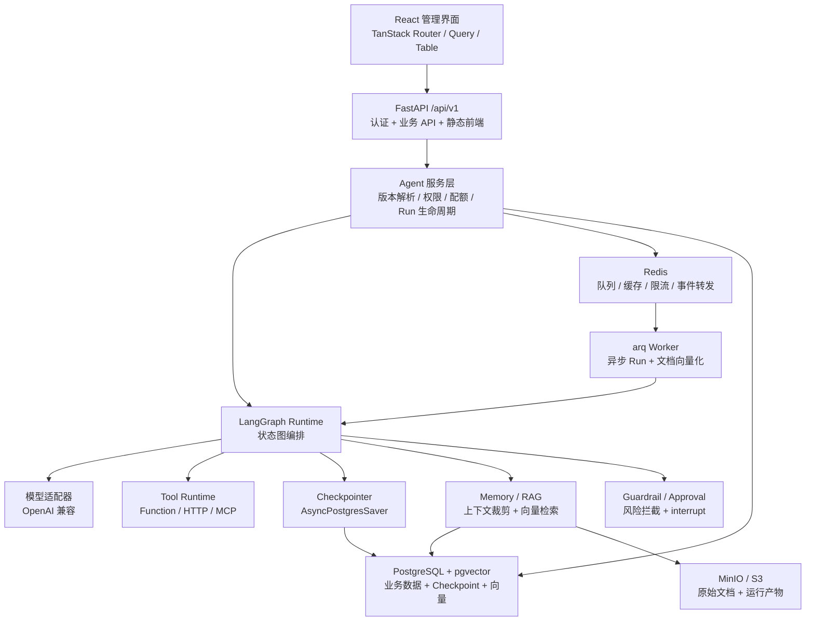
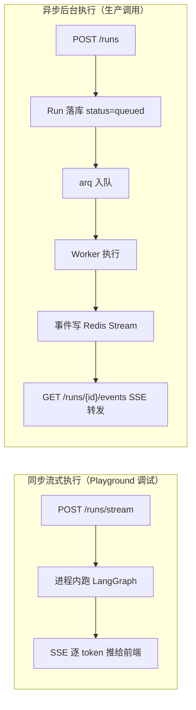
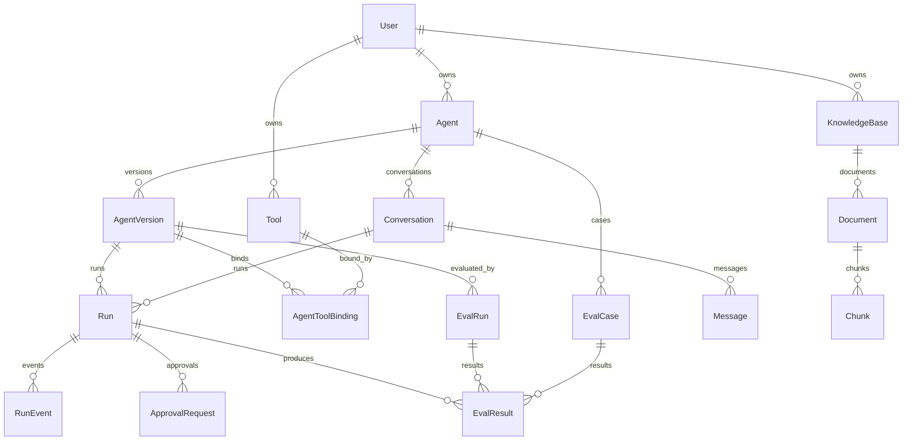
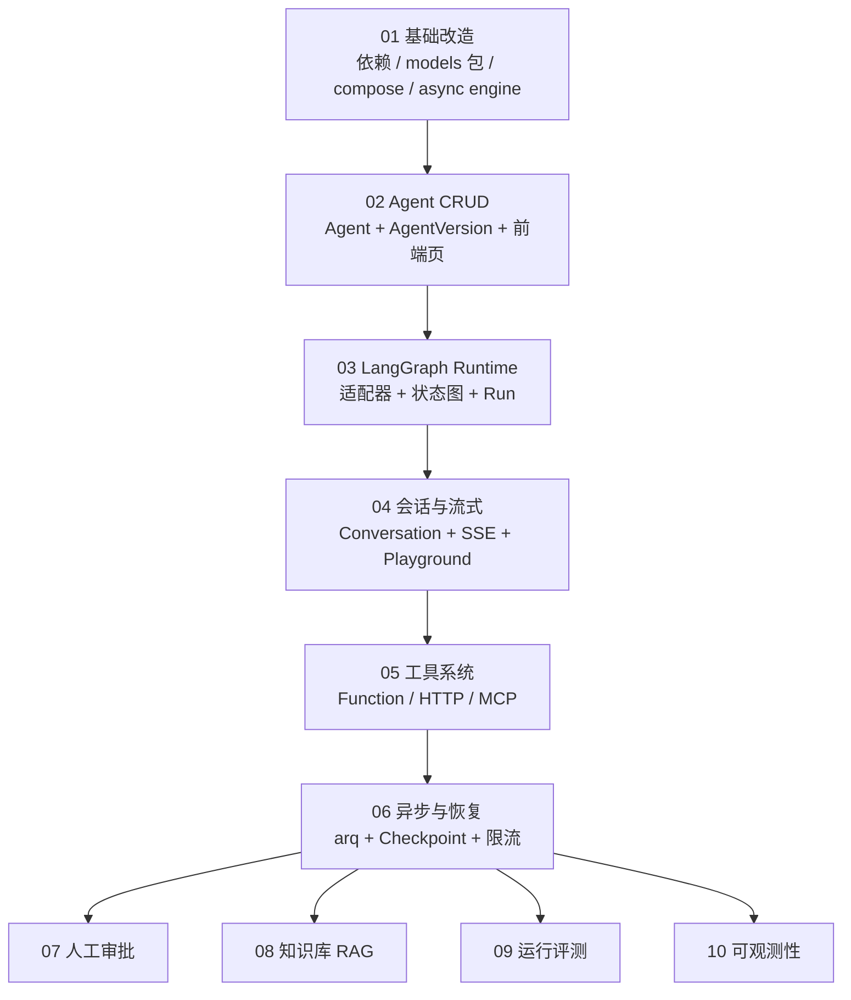

# 00 — 架构总览与数据模型全景

**本文档只读，不含执行任务。** 它的作用是让每个 subagent 对整体形态、术语和数据模型有一致理解，避免各阶段之间定义冲突。

阅读顺序：先读 [AGENTS.md](../../AGENTS.md)，再读本文件，再读当前阶段文档。

---

## 1. 系统分层



FastAPI 继续作为唯一应用入口，同时提供业务 API、认证和构建后的前端页面（`app.frontend("/", directory=FRONTEND_DIR)`）。

### 1.1 两种执行模式

短任务和长任务走不同路径，这是整个平台的核心分流逻辑：



判定规则：Playground 手动调试用同步流式；带工具写操作、需要审批、预计超过 60 秒的用异步。阶段 03/04 先只做同步路径，阶段 06 再补异步路径。

---

## 2. 核心概念与术语

术语在所有代码、文档、API 和 UI 文案里必须一致使用。

| 术语 | 含义 | 关键约束 |
|------|------|----------|
| **Agent** | 用户创建的 Agent 定义，可持续编辑的"草稿" | 属于某个 User，配置随时可改 |
| **AgentVersion** | 发布时对 Agent 全部配置打的不可变快照 | 一旦创建就**只读**，任何 Run 必须关联一个具体 version |
| **Conversation** | 一串多轮对话的容器 | 绑定到某个 Agent，持有 LangGraph 的 `thread_id` |
| **Message** | 对话里的一条消息 | 角色为 user / assistant / tool / system |
| **Run** | 一次 Agent 执行 | 关联 AgentVersion 和 Conversation，记录状态、耗时、Token、费用 |
| **RunEvent** | Run 执行过程中的一条事件 | 节点进出、工具调用、模型输出、错误，是执行轨迹的持久化形式 |
| **Tool** | 一个可被 Agent 调用的工具定义 | 三种类型：function / http / mcp |
| **ApprovalRequest** | 一次待人工审批的暂停点 | 关联 Run 和触发它的工具调用 |
| **KnowledgeBase** | 一个知识库，含多个 Document | 检索的单位 |
| **Chunk** | 文档切片及其向量 | 承载 pgvector 的 `embedding` 列 |
| **EvalCase** | 一条评测用例（输入 + 期望） | 属于某个 Agent |
| **EvalRun** | 一次评测批次 | 对指定 AgentVersion 跑一批 EvalCase |

### 2.1 Agent 与 AgentVersion 的关系

这是最容易搞混的地方，**必须严格遵守**：

- `Agent` 表存的是**当前可编辑配置**，用户在 UI 上改的就是它
- 点"发布"时，把 Agent 的全部配置深拷贝成一条 `AgentVersion`，`version_number` 自增
- **任何 Run 都必须指向 AgentVersion，绝不能直接指向 Agent 的当前配置**。否则历史运行无法复现，评测也失去意义
- Playground 调试时也要先落一个临时 version，或者用 `AgentVersion` 的 `is_draft` 标记区分

---

## 3. 数据模型全景

下图是最终形态（阶段 10 完成后）。每个阶段只新增自己那部分表。



### 3.1 各表字段要点

字段清单在各阶段文档里给出完整定义，这里只列**跨阶段必须对齐的关键字段**。

**Agent**（阶段 02）
`id`, `owner_id`, `name`, `description`, `system_prompt`, `llm_model`, `llm_settings`(JSONB), `max_iterations`, `timeout_seconds`, `is_active`, `created_at`, `updated_at`

字段用 `llm_` 前缀而不是 `model_`，因为 Pydantic v2 保留了 `model_` 命名空间。这个约定对所有表生效。

**AgentVersion**（阶段 02）
`id`, `agent_id`, `version_number`(对同一 agent 唯一), `snapshot`(JSONB，完整配置深拷贝), `changelog`, `is_draft`, `created_at`
配置以 JSONB 快照形式存储而不是逐字段复制，这样后续阶段给 Agent 加字段时不用改 AgentVersion 表结构。

**Conversation**（阶段 04）
`id`, `owner_id`, `agent_id`, `title`, `thread_id`(给 LangGraph checkpointer 用，建唯一索引), `summary`(上下文摘要), `created_at`, `updated_at`

**Message**（阶段 04）
`id`, `conversation_id`, `role`, `content`, `tool_calls`(JSONB), `tool_call_id`, `token_count`, `created_at`

**Run**（阶段 03 建表，阶段 06 加字段）
`id`, `owner_id`, `agent_version_id`, `conversation_id`(可空), `status`, `trigger`(playground/api/eval), `input`(JSONB), `output`(JSONB), `error`, `started_at`, `finished_at`, `duration_ms`, `prompt_tokens`, `completion_tokens`, `cost_usd`, `thread_id`, `checkpoint_id`, `created_at`

`status` 取值固定为：`queued` / `running` / `waiting_approval` / `succeeded` / `failed` / `cancelled`。**这套取值在阶段 03 就要定全**，后面阶段只是开始用到更多值，不要新增。

**RunEvent**（阶段 03）
`id`, `run_id`, `seq`(同 run 内递增), `event_type`, `node_name`, `payload`(JSONB), `created_at`

`event_type` 取值：`run_started` / `node_started` / `node_finished` / `model_chunk` / `tool_called` / `tool_result` / `context_retrieved` / `approval_requested` / `approval_resolved` / `run_finished` / `run_failed`。全部在阶段 03 定义好，后续阶段只是开始用到更多值。

枚举列是 varchar 而不是 Postgres 原生 enum，所以万一后续真的需要加值也不用 `ALTER TYPE`。但仍然应该在阶段 03 一次定全，避免前端的事件处理逻辑反复改。

**Tool**（阶段 05）
`id`, `owner_id`, `name`, `description`, `tool_type`(function/http/mcp), `parameters_schema`(JSONB, JSON Schema), `config`(JSONB, 类型相关配置), `requires_approval`, `timeout_seconds`, `is_active`, `created_at`

**AgentToolBinding**（阶段 05）
`id`, `agent_version_id`, `tool_id`, `config_override`(JSONB), `created_at`

**ApprovalRequest**（阶段 07）
`id`, `run_id`, `tool_name`, `tool_args`(JSONB), `reason`, `status`(pending/approved/rejected), `resolved_by_id`, `resolved_at`, `checkpoint_id`, `created_at`

**KnowledgeBase / Document / Chunk**（阶段 08）
KnowledgeBase: `id`, `owner_id`, `name`, `description`, `embedding_model`, `chunk_size`, `chunk_overlap`, `created_at`
Document: `id`, `knowledge_base_id`, `filename`, `storage_key`(MinIO object key), `mime_type`, `size_bytes`, `status`(pending/processing/ready/failed), `error`, `created_at`
Chunk: `id`, `document_id`, `seq`, `content`, `embedding`(pgvector `Vector(dim)`), `metadata_`(JSONB), `created_at`

**EvalCase / EvalRun / EvalResult**（阶段 09）
EvalCase: `id`, `agent_id`, `name`, `input`(JSONB), `expected_output`, `assertions`(JSONB), `created_at`
EvalRun: `id`, `owner_id`, `agent_version_id`, `status`, `case_count`, `passed_count`, `avg_duration_ms`, `total_cost_usd`, `created_at`, `finished_at`
EvalResult: `id`, `eval_run_id`, `eval_case_id`, `run_id`, `passed`, `score`, `actual_output`, `duration_ms`, `cost_usd`, `created_at`

### 3.2 LangGraph 自己的表不走 Alembic

`langgraph-checkpoint-postgres` 会自己创建并维护 `checkpoints`、`checkpoint_blobs`、`checkpoint_writes`、`checkpoint_migrations` 四张表，通过调用 `await checkpointer.setup()` 完成。

**这些表绝不能进 Alembic 的 autogenerate**，否则每次生成迁移都会试图删掉它们。阶段 06 会给出在 `alembic/env.py` 里配置 `include_object` 排除这些表名的具体做法。

---

## 4. 目录规划

阶段 01 建立骨架，后续阶段往里填。最终形态：

```
backend/app/
├── models/                   # 阶段 01 从 models.py 拆出
│   ├── __init__.py           # 重导出全部符号
│   ├── base.py               # get_datetime_utc, Message, Token 等通用
│   ├── user.py
│   ├── agent.py              # 阶段 02
│   ├── run.py                # 阶段 03
│   ├── conversation.py       # 阶段 04
│   ├── tool.py               # 阶段 05
│   ├── approval.py           # 阶段 07
│   ├── knowledge.py          # 阶段 08
│   └── eval.py               # 阶段 09
├── crud/                     # 阶段 01 从 crud.py 拆出
│   ├── __init__.py
│   ├── user.py
│   ├── agent.py
│   └── ...
├── api/routes/
│   ├── agents.py             # 阶段 02
│   ├── runs.py               # 阶段 03
│   ├── conversations.py      # 阶段 04
│   ├── tools.py              # 阶段 05
│   ├── approvals.py          # 阶段 07
│   ├── knowledge.py          # 阶段 08
│   └── evals.py              # 阶段 09
├── agent/                    # Agent 运行时，阶段 03 建立
│   ├── __init__.py
│   ├── graph.py              # 状态图构建
│   ├── state.py              # AgentState TypedDict
│   ├── nodes.py              # 各节点实现
│   ├── models/               # 模型适配器
│   │   ├── base.py           # 抽象接口
│   │   └── openai_compat.py  # 唯一实现
│   ├── tools/                # 阶段 05
│   │   ├── registry.py
│   │   ├── function.py
│   │   ├── http.py
│   │   └── mcp.py
│   ├── memory.py             # 阶段 04 上下文裁剪
│   ├── retrieval.py          # 阶段 08 向量检索
│   ├── guardrail.py          # 阶段 07
│   └── checkpoint.py         # 阶段 06
├── services/                 # 服务层，阶段 03 建立
│   ├── run_service.py
│   ├── agent_service.py
│   └── ...
├── core/
│   ├── config.py
│   ├── db.py                 # 同步 engine
│   ├── async_db.py           # 阶段 01 新增：async engine
│   ├── redis.py              # 阶段 06
│   ├── storage.py            # 阶段 08 MinIO 客户端
│   └── security.py
└── worker/                   # 阶段 06
    ├── __init__.py
    ├── main.py               # arq WorkerSettings
    └── tasks.py
```

前端：

```
frontend/src/
├── routes/_layout/
│   ├── agents.tsx            # 阶段 02
│   ├── agents.$agentId.tsx   # 阶段 02 详情/编辑
│   ├── playground.tsx        # 阶段 04
│   ├── runs.tsx              # 阶段 03/06
│   ├── runs.$runId.tsx       # 阶段 03 执行轨迹
│   ├── tools.tsx             # 阶段 05
│   ├── approvals.tsx         # 阶段 07
│   ├── knowledge.tsx         # 阶段 08
│   ├── evals.tsx             # 阶段 09
│   └── monitoring.tsx        # 阶段 10（仅管理员）
└── components/
    ├── Agents/
    ├── Runs/
    ├── Playground/
    ├── Tools/
    ├── Approvals/
    ├── Knowledge/
    └── Evals/
```

---

## 5. 阶段依赖图



01 到 06 是一条串行主干，必须按序完成。07 到 10 是四个独立分支，都只依赖 06。

**里程碑**：
- 阶段 04 结束时，平台已经能在 Playground 里跟 Agent 多轮对话并看到流式输出 —— 这是第一个可演示形态
- 阶段 06 结束时，具备生产后端的核心能力（异步、恢复、限流） —— 这是简历上可以称为"平台"的分界线
- 阶段 07 到 10 是差异化亮点，按时间和精力挑选完成

---

## 6. 各阶段验收标准汇总

每个阶段文档末尾有详细的逐条验收清单。这里是一句话总结，用于快速确认前置阶段是否真的完成了。

| 阶段 | 一句话验收 |
|------|-----------|
| 01 | `uv sync` 成功装上 LangGraph 全家桶，`docker compose up -d` 起来 db（含 vector 扩展）/ redis / minio，`bash scripts/lint.sh` 和 `bash scripts/test.sh` 全绿，`from app.models import User, Item` 仍然可用 |
| 02 | 能在 UI 上创建 Agent、编辑配置、点发布生成 v1、在版本列表里看到快照；Item 已彻底移除且测试全绿 |
| 03 | `POST /api/v1/runs` 用真实模型跑通一次对话，Run 表记录了状态/耗时/Token/费用，RunEvent 表有完整节点轨迹，前端能看到 Run 详情 |
| 04 | Playground 页面里输入问题，回复逐字出现，刷新页面后历史对话仍在，第二轮提问能引用第一轮上下文 |
| 05 | 注册一个 HTTP 工具后，Agent 能自主决定调用它并把结果用进回复，工具超时和参数校验失败都有明确错误 |
| 06 | 提交一个异步 Run，worker 拉起并执行，中途 kill worker 后重启能从 checkpoint 续跑而不是重头开始 |
| 07 | 给工具打上 `requires_approval` 后，Run 停在 `waiting_approval`，UI 上点批准后执行继续并完成 |
| 08 | 上传一个 PDF，等状态变 ready，提问时 Agent 引用文档内容并在回复里标出来源 |
| 09 | 对同一 Agent 的 v1 和 v2 各跑同一批用例，结果页并列显示通过率、平均延迟和成本差异 |
| 10 | Grafana 里能看到请求量、Run 成功率、模型 Token 用量曲线，管理员页能列出最近失败的 Run |

---

## 7. 反复出现的坑（提前知道能省很多时间）

1. **忘记跑 `generate-client.sh`**：改完后端接口直接写前端，`AgentsService` 不存在或方法签名对不上。一改后端就跑。
2. **`models/__init__.py` 漏导出**：Alembic autogenerate 会生成"删除这张表"的迁移。新模型文件建完立刻加到 `__init__.py`。
3. **`conftest.py` teardown 没加新表**：外键约束导致 `db` fixture 清理失败，全部测试红。加表就加 delete，且子表在前。
4. **在同步路由里 `await`**：直接运行时报错。Agent 执行相关的接口要么整个声明成 `async def` 并用 `AsyncSession`，要么用服务层包一层。
5. **pgvector 列的 autogenerate**：Alembic 经常把 `Vector(1536)` 生成成错的类型，需要手工修迁移文件并确保 `from pgvector.sqlalchemy import Vector` 被 import 进去。
6. **LangGraph checkpoint 表被 Alembic 误删**：见 3.2，必须配 `include_object` 排除。
7. **`tags` 改名导致前端大面积失效**：`tags[0]` 决定 Service 类名。一旦定了就不要改。
8. **JSONB 字段的 SQLModel 写法**：需要 `Field(default_factory=dict, sa_type=JSONB)`，直接标注 `dict` 会被建成不可查询的类型。
