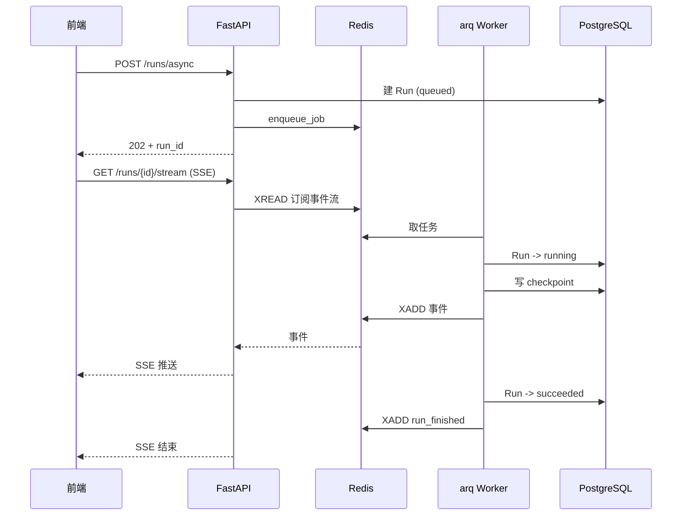

# 06 — 异步执行、状态恢复与限流

## 前置依赖

阶段 [05_1-mcp-service.md](05_1-mcp-service.md) 的验收清单全部通过（其前置为 05）。特别确认：

- 工具调用在 Playground 里可用，能看到工具块
- SSRF 防护和 `max_iterations` 守卫的测试全部通过
- 独立 `mcp-docs` 服务可用，真实模型经 Streamable HTTP 调用已验证
- 已明确主机与 Compose 地址，定向 MCP 信任配置生效，全局私网与 stdio 开关仍关闭

### MCP 接入约定（本阶段必须落实）

遵循 [05_1 的后续使用契约](05_1-mcp-service.md#后续阶段的使用契约)，在下述 worker、恢复和测试任务中落实：

- worker 能访问 `http://mcp-docs:3001/mcp`，透传与 API 相同的 `MCP_TRUSTED_SERVER_URLS`；不使用容器内 localhost 指向外部服务。
- worker 内创建自己的 MCP 客户端，shutdown 时调用 05_1 的异步关闭入口。不要复用 API 进程的连接、事件循环或缓存。
- 恢复时按 AgentVersion 重新加载工具并建立连接；MCP 会话、工具实例、future 不进入 Checkpoint。MCP 服务的无状态模式不等于 LangGraph 无状态。
- 不因 worker 重投而在 MCP 执行器里增加自动调用重试。外部工具执行成功、checkpoint 尚未提交时进程崩溃，仍可能重复调用；使用只读文档工具验证此边界，不宣称 exactly-once。将来有副作用工具需独立设计幂等机制。
- 工具失败、超时、取消、同名调用 index 及结果继续使用 05 的 ToolResult / RunEvent 契约，经 Redis Stream 转发后语义不变。

## 本阶段目标

### Windows 本地 worker 兼容约定

2026-09-17 已在阶段 06 实现前完成独立兼容探针；这不是阶段 06 功能验收。环境为 Windows、Python 3.14.5、arq 0.28.0、redis-py 5.3.1、Redis server 8.10.1，数据库使用 `agenthub_phase0102_audit`。

| 启动 / 退出条件 | 实测结果 |
|---|---|
| 默认 ProactorEventLoop | Redis 入队和消费成功，异步 PostgreSQL 查询失败：psycopg 不支持该事件循环 |
| `asyncio.Runner(loop_factory=asyncio.SelectorEventLoop)`，在 async 函数内创建 Worker | 入队、消费、`SELECT 1`、结果读取均成功 |
| Selector + Worker 默认 `handle_signals=True` | arq 捕获 Windows 不支持 `loop.add_signal_handler` 的异常；程序调用 `handle_sig(SIGINT)` 能取消执行中任务，`close()` 完成并释放连接 |
| `handle_signals=False`，直接调用 arq 0.28.0 的 `close()` | 失败：`signal.SIGUSR1` 在 Windows 不存在。不能直接用这个选项作为 Windows 修复 |

后续实现要求：

1. Linux / Compose 继续使用常规 arq 启动；Windows 本地入口显式使用 Runner 的 Selector loop factory，不新增已弃用的全局 event-loop policy。
2. 在 Runner 管理的异步函数内创建 Worker，调用 `async_run()`。在 finally 中明确取消 worker 正在执行的任务、等待 `close()` 和项目 shutdown 钩子完成；保留 `handle_signals=True`，由 Runner/入口负责 Windows 控制台退出处理。
3. 不在本阶段之前修改生产 worker 文件。真正的 Windows Ctrl+C、watch 重启、kill/restart 后 Run 状态与 checkpoint 恢复仍须阶段 06 验证；本次只验证了程序触发的 SIGINT 处理路径，不能将两者混写。
4. 这些结论针对上述版本。阶段 06 安装 arq 后再次运行探针，若版本不同，重新确认关闭逻辑；不得通过假造 `signal.SIGUSR1` 或修改 site-packages 绕过。

探针文件为 [check_windows_worker.py](../../backend/scripts/check_windows_worker.py)。它仅执行只读数据库查询，使用独立 UUID 队列并删除自身 Redis 键，不写业务 Run，不调用模型。主动取消用例会产生 arq 的 CancelledError 日志，脚本退出码 0 才表示预期检查通过。

常规隔离依赖命令（backend 目录）：

```powershell
uv run --with arq==0.28.0 python scripts/check_windows_worker.py
```

本机 `uv run --with` 曾出现 Windows PE trampoline 更新“拒绝访问”；这是工具启动失败，不是 arq 任务失败。实际完成验证的替代命令如下，不修改项目 pyproject 或 uv.lock：

```powershell
$probeDeps = Join-Path $env:LOCALAPPDATA 'AgentHub/worker-probe-deps'
uv pip install --target $probeDeps arq==0.28.0
$previousPythonPath = $env:PYTHONPATH
try {
    $env:PYTHONPATH = $probeDeps
    & ../.venv/Scripts/python.exe scripts/check_windows_worker.py
} finally {
    $env:PYTHONPATH = $previousPythonPath
}
```

脚本使用配置中的 Redis/数据库地址；本次通过进程环境指定专用数据库，未改 `.env`。加 `--loop default` 可复现 Proactor 失败，预期非零退出。参考：[arq Worker 文档及实现](https://arq-docs.helpmanual.io/_modules/arq/worker)。

### 功能目标

这是**主干的最后一个阶段，也是"简历上能称为平台"的分界线**。做完之后系统具备生产后端的核心能力：

- arq worker 进程，长任务不占用 API 进程
- LangGraph Checkpoint 持久化，进程崩了能从断点续跑
- 事件通过 Redis Stream 转发，worker 里的执行过程能实时推给前端
- 失败重试和手动取消
- Redis 限流，防止单用户打满模型配额

## 本阶段不做什么

不做审批（阶段 07，但本阶段要把 `interrupt` 的基础设施铺好）。

---

## 架构变化

阶段 04 的流式执行是"请求打进来就在 API 进程里跑完"。本阶段增加第二条路径：



两条路径共用同一套图、节点和事件类型。区别只在于**谁在跑**和**事件怎么传**。

选择规则写进 API 文档：Playground 调试用同步流式（`/conversations/{id}/stream`），生产调用和长任务用异步（`/runs/async`）。

---

## 任务 1：Redis 客户端与依赖

### 1.1 装依赖

```bash
cd backend
uv add "arq>=0.26" "redis>=5"
```

`arq` 自带 redis 依赖，但显式加上 `redis` 方便直接用它做限流和 Stream。

### 1.2 Redis 客户端

新建 `backend/app/core/redis.py`：

```python
from collections.abc import AsyncGenerator

from redis.asyncio import Redis, from_url

from app.core.config import settings

_pool: Redis | None = None


def get_redis() -> Redis:
    """进程级共享的 Redis 客户端。redis-py 内部自带连接池。"""
    global _pool
    if _pool is None:
        _pool = from_url(
            settings.REDIS_URL,
            encoding="utf-8",
            decode_responses=True,
        )
    return _pool


async def close_redis() -> None:
    global _pool
    if _pool is not None:
        await _pool.aclose()
        _pool = None
```

`decode_responses=True` 让所有返回值是 `str` 而不是 `bytes`，省掉到处 `.decode()`。

在 `app/main.py` 里用 lifespan 关闭连接：

```python
from contextlib import asynccontextmanager


@asynccontextmanager
async def lifespan(app: FastAPI):
    yield
    await close_redis()


app = FastAPI(..., lifespan=lifespan)
```

### 1.3 arq 的 Redis 配置

arq 用自己的连接配置对象。新建 `backend/app/worker/settings.py`：

```python
from urllib.parse import urlparse

from arq.connections import RedisSettings

from app.core.config import settings


def get_arq_redis_settings() -> RedisSettings:
    parsed = urlparse(settings.REDIS_URL)
    return RedisSettings(
        host=parsed.hostname or "localhost",
        port=parsed.port or 6379,
        database=int(parsed.path.lstrip("/") or 0),
        password=parsed.password,
    )
```

arq 也提供 `RedisSettings.from_dsn(settings.REDIS_URL)`，如果当前版本有就用它，代码更短。

---

## 任务 2：Checkpoint 持久化

### 2.1 先处理 Alembic 排除

**这一步必须在建 checkpointer 之前做**，否则下一次 `alembic revision --autogenerate` 会生成"删除 checkpoints 表"的迁移。

`langgraph-checkpoint-postgres` 自己创建并管理这四张表：`checkpoints`、`checkpoint_blobs`、`checkpoint_writes`、`checkpoint_migrations`。它们不在 SQLModel 的 metadata 里，所以 Alembic 认为它们是"多余的表"。

修改 `backend/app/alembic/env.py`，加一个 `include_object` 钩子：

```python
# LangGraph checkpointer 自己创建并迁移这些表，不受 Alembic 管理。
LANGGRAPH_TABLES = {
    "checkpoints",
    "checkpoint_blobs",
    "checkpoint_writes",
    "checkpoint_migrations",
}


def include_object(object, name, type_, reflected, compare_to):  # noqa: A002, ANN001, ANN201
    if type_ == "table" and name in LANGGRAPH_TABLES:
        return False
    return True
```

然后在**两处** `context.configure(...)` 调用里都加上这个参数（offline 和 online 模式各一处）：

```python
    context.configure(
        connection=connection,
        target_metadata=target_metadata,
        compare_type=True,
        include_object=include_object,
    )
```

漏掉任何一处，对应模式下的 autogenerate 就会出错。

`include_object` 的签名是 Alembic 规定的位置参数形式，`object` 和 `name` 这些参数名不能改，所以需要 `# noqa` 压掉 ruff 的告警。

### 2.2 Checkpointer

新建 `backend/app/agent/checkpoint.py`：

```python
from contextlib import asynccontextmanager

from langgraph.checkpoint.postgres.aio import AsyncPostgresSaver

from app.core.config import settings


def _checkpoint_conn_string() -> str:
    """
    AsyncPostgresSaver 直接用 psycopg 连接，不走 SQLAlchemy，
    所以需要去掉 URL 里的 +psycopg dialect 后缀。
    """
    return str(settings.DATABASE_URL).replace("postgresql+psycopg://", "postgresql://")


@asynccontextmanager
async def checkpointer_context():
    """
    获取一个 checkpointer。每次使用都建连接，用完释放。

    注意 setup() 是幂等的，但它会查询 checkpoint_migrations 表，
    有一次数据库往返开销。生产环境应该在启动时调一次，
    见 setup_checkpointer_once。
    """
    async with AsyncPostgresSaver.from_conn_string(
        _checkpoint_conn_string()
    ) as checkpointer:
        yield checkpointer


async def setup_checkpointer_once() -> None:
    """建 checkpoint 相关表。在 prestart 脚本里调一次。"""
    async with checkpointer_context() as checkpointer:
        await checkpointer.setup()
```

**`setup()` 必须被调用一次**，否则第一次写 checkpoint 会报表不存在。放在 prestart 里而不是每次请求：

新建 `backend/app/setup_checkpointer.py`：

```python
import asyncio
import logging

from app.agent.checkpoint import setup_checkpointer_once

logging.basicConfig(level=logging.INFO)
logger = logging.getLogger(__name__)


def main() -> None:
    asyncio.run(setup_checkpointer_once())
    logger.info("Checkpointer tables ready")


if __name__ == "__main__":
    main()
```

在 `backend/scripts/prestart.sh` 的 `alembic upgrade head` **之后**加一行：

```bash
# Create LangGraph checkpointer tables (not managed by Alembic)
python app/setup_checkpointer.py
```

放在 alembic 之后是因为它需要数据库已就绪，放在 `initial_data.py` 之前或之后都行。

### 2.3 编译带 checkpointer 的图

修改 `app/agent/graph.py`：

```python
def compile_agent_graph(
    *,
    tools: list[StructuredTool] | None = None,
    checkpointer: BaseCheckpointSaver | None = None,
):
    return build_agent_graph(tools).compile(checkpointer=checkpointer)
```

`checkpointer=None` 时行为与之前完全一致（无持久化），所以阶段 04 的同步流式路径不需要改动。

### 2.4 thread_id 与 config

LangGraph 通过 `config` 里的 `thread_id` 定位 checkpoint：

```python
config = {"configurable": {"thread_id": thread_id}}
await app.ainvoke(initial_state, config=config)
```

**thread_id 的取值规则**（这是关键决策，写进代码注释）：

- 所有异步 Run（包括 conversation）首次用 `f"run-{run.id}-0"`，各轮独立；会话历史由 `message` 表和 `build_context_messages` 提供，避免重复累积。
- 断点重试保留原 thread_id，并读取 saver 的最新 checkpoint；从头重跑用 `f"run-{run.id}-{run.retry_count}"`，不读取旧线程状态。

Run 表的 `thread_id` 字段记录实际使用的值，恢复时直接读它。

### 2.5 消息历史的双重存储问题

注意这里有个概念重叠：**消息历史同时存在两个地方** —— `message` 表（我们自己的）和 checkpoint（LangGraph 的）。

这不是设计缺陷，两者用途不同：

- `message` 表是**业务数据**：给前端展示、给用户导出、给评测对比，结构稳定可查询
- checkpoint 是**执行状态**：包含完整的 `AgentState`（含中间状态、pending 的工具调用），只用于恢复执行

规则：**读历史给前端看就查 `message` 表，恢复执行就用 checkpoint，永远不要交叉使用**。组装新一轮对话的上下文时仍然用 `message` 表 + `build_context_messages`（阶段 04 的逻辑不变），不要从 checkpoint 里读。

把这段说明写进 `app/agent/checkpoint.py` 的模块 docstring，后面的人一定会问这个问题。

---

## 任务 3：Worker 进程

### 3.1 任务函数

新建 `backend/app/worker/tasks.py`：

```python
async def execute_run_task(ctx: dict[str, Any], run_id: str) -> dict[str, Any]:
    """
    在 worker 里执行一个 Run。

    只传 run_id 而不传整个 Run 对象：任务参数要走 Redis 序列化，
    传 id 最小化序列化面，也保证 worker 读到的是最新状态。
    """
    run_uuid = uuid.UUID(run_id)
    async with async_session_maker() as session:
        run = await session.get(Run, run_uuid)
        if run is None:
            logger.error("Run %s not found", run_id)
            return {"status": "not_found"}
        if run.status not in (RunStatus.QUEUED, RunStatus.RUNNING):
            # 已经被取消或已完成，不重复执行
            logger.info("Run %s is %s, skipping", run_id, run.status)
            return {"status": run.status.value}

        version = await session.get(AgentVersion, run.agent_version_id)
        snapshot = AgentSnapshot.model_validate(version.snapshot)
        tools = await load_tools_for_version(
            session=session, agent_version_id=run.agent_version_id
        )
        publisher = RedisEventPublisher(redis=get_redis(), run_id=run_uuid)

        try:
            await execute_run_with_checkpoint(
                session=session,
                run=run,
                snapshot=snapshot,
                tools=tools,
                publisher=publisher,
            )
        finally:
            await publisher.close()

        return {"status": run.status.value}
```

**幂等检查不能省**。arq 在 worker 崩溃后会重投任务，同一个 run_id 可能被执行两次。检查 `run.status` 让重复执行变成 no-op。

### 3.2 WorkerSettings

新建 `backend/app/worker/main.py`：

```python
from arq import cron

from app.worker.settings import get_arq_redis_settings
from app.worker.tasks import execute_run_task, reap_stale_runs


async def startup(ctx: dict[str, Any]) -> None:
    logger.info("Worker starting up")


async def shutdown(ctx: dict[str, Any]) -> None:
    await close_redis()
    logger.info("Worker shut down")


class WorkerSettings:
    functions = [execute_run_task]
    cron_jobs = [cron(reap_stale_runs, minute=set(range(0, 60, 5)))]
    redis_settings = get_arq_redis_settings()
    on_startup = startup
    on_shutdown = shutdown
    max_jobs = 5
    job_timeout = 900          # 15 分钟硬上限，大于任何 agent 的 timeout_seconds
    max_tries = 2              # 失败重投一次
    keep_result = 3600
```

启动命令：

```bash
cd backend
uv run arq app.worker.main.WorkerSettings
```

`job_timeout` 必须大于 Agent 配置的 `timeout_seconds` 上限（3600）—— 这里设 900 是因为实际不会有那么长的 Agent。**如果 Agent 的 timeout 大于 job_timeout，arq 会在 Agent 自己超时之前杀掉任务，Run 就会卡在 `running`**。要么调大 `job_timeout`，要么在创建 Run 时校验 `timeout_seconds <= 900`。选后者，在 `/runs/async` 里校验并返回 400。

`max_tries = 2` 意味着失败会自动重投一次。配合 checkpoint，重投时会从断点继续而不是重头跑。

### 3.3 僵尸 Run 清理

`max_jobs` 满、worker 被 kill -9、机器重启，都可能让 Run 永远停在 `running`。加一个定时任务兜底：

```python
async def reap_stale_runs(ctx: dict[str, Any]) -> int:
    """
    把长时间停在 running 的 Run 标记为 failed。

    判定标准：started_at 距今超过 job_timeout + 缓冲。
    每 5 分钟跑一次。
    """
    cutoff = get_datetime_utc() - timedelta(seconds=STALE_RUN_THRESHOLD_SECONDS)
    async with async_session_maker() as session:
        result = await session.execute(
            select(Run).where(
                Run.status == RunStatus.RUNNING,
                Run.started_at < cutoff,
            )
        )
        stale = list(result.scalars().all())
        for run in stale:
            run.status = RunStatus.FAILED
            run.error = "Run was interrupted and did not resume in time"
            run.finished_at = get_datetime_utc()
            session.add(run)
        await session.commit()
    if stale:
        logger.warning("Reaped %d stale runs", len(stale))
    return len(stale)
```

`STALE_RUN_THRESHOLD_SECONDS = 1200`（job_timeout 900 + 300 缓冲）。

这个定时任务是验收清单里"没有 Run 卡在 running"那条的最终保障。

### 3.4 Compose 服务

`compose.yml` 加：

```yaml
  worker:
    image: backend:latest
    depends_on:
      db:
        condition: service_healthy
        restart: true
      redis:
        condition: service_healthy
    environment:
      # 与 backend 服务完全相同的环境变量，复制一份
      PROJECT_NAME: ${PROJECT_NAME:?Variable not set}
      SECRET_KEY: ${SECRET_KEY:?Variable not set}
      DATABASE_URL: postgresql://postgres:${POSTGRES_PASSWORD:?Variable not set}@db:5432/app
      REDIS_URL: redis://redis:6379/0
      LLM_API_KEY: ${LLM_API_KEY:-}
      LLM_BASE_URL: ${LLM_BASE_URL:-}
      LLM_MODEL: ${LLM_MODEL:-}
      # ... 其余与 backend 一致
    build:
      context: .
      dockerfile: backend/Dockerfile
    command: ["arq", "app.worker.main.WorkerSettings"]
```

worker **复用 backend 镜像**，只是换启动命令。不要单独写 Dockerfile。

环境变量重复是 compose 的固有啰嗦。可以用 YAML 锚点减少重复：

```yaml
x-backend-env: &backend-env
  PROJECT_NAME: ${PROJECT_NAME:?Variable not set}
  SECRET_KEY: ${SECRET_KEY:?Variable not set}
  # ...

services:
  backend:
    environment: *backend-env
  worker:
    environment: *backend-env
```

注意 backend 有几个 worker 不需要的变量（SMTP 之类），共享锚点会让 worker 也拿到，无害。但 `compose.override.yml` 里 backend 的 `FASTAPI_ENV: development` 覆盖要单独给 worker 也加一份。

`compose.override.yml` 里给 worker 加源码同步：

```yaml
  worker:
    environment:
      FASTAPI_ENV: "development"
    develop:
      watch:
        - path: ./backend
          action: sync+restart
          target: /app/backend
          ignore:
            - .venv
```

使用 `docker compose watch worker` 同步源码并重启进程。arq 0.28.0 的 `--watch` 未重新导入应用模块，不能作为源码热重载；Windows 本地入口修改后手动 Ctrl+C 再启动，见偏差记录。

---

## 任务 4：事件通过 Redis Stream 转发

worker 在另一个进程里跑，它产生的事件要能推给正在看页面的用户。用 Redis Stream 做这个转发。

### 4.1 发布端

新建 `backend/app/services/event_bus.py`：

```python
EVENT_STREAM_MAXLEN = 1000
EVENT_STREAM_TTL_SECONDS = 3600


def run_stream_key(run_id: uuid.UUID) -> str:
    return f"agenthub:run:{run_id}:events"


class RedisEventPublisher:
    """把 Run 事件发布到 Redis Stream，供 API 进程订阅转发。"""

    def __init__(self, *, redis: Redis, run_id: uuid.UUID) -> None:
        self._redis = redis
        self._key = run_stream_key(run_id)

    async def publish(
        self, event_type: RunEventType, payload: dict[str, Any]
    ) -> None:
        await self._redis.xadd(
            self._key,
            {"type": event_type.value, "payload": json.dumps(payload, default=str)},
            maxlen=EVENT_STREAM_MAXLEN,
            approximate=True,
        )

    async def close(self) -> None:
        """执行结束后给 stream 设过期，避免 Redis 里堆积历史事件。"""
        await self._redis.expire(self._key, EVENT_STREAM_TTL_SECONDS)
```

要点：

- `maxlen` + `approximate=True` 限制单个 stream 的长度。一次执行几百个 `model_chunk`，不限长会占用大量内存
- `close()` 里设 TTL 而不是直接删。用户可能在执行结束后才打开页面，保留 1 小时让他能回看
- Stream 只做**实时转发**，不是持久存储。历史事件在 `run_event` 表里

### 4.2 订阅端

```python
async def subscribe_run_events(
    *, redis: Redis, run_id: uuid.UUID, last_id: str = "0"
) -> AsyncGenerator[tuple[str, dict[str, Any]]]:
    """
    订阅某个 Run 的事件流。

    last_id="0" 表示从头读（能拿到已经发生的事件），
    这样用户在执行中途打开页面也能看到完整过程。
    """
    key = run_stream_key(run_id)
    while True:
        entries = await redis.xread({key: last_id}, count=50, block=5000)
        if not entries:
            # 阻塞超时，检查 Run 是否已经结束
            if await _is_run_finished(run_id):
                return
            continue
        for _stream_key, messages in entries:
            for message_id, fields in messages:
                last_id = message_id
                yield (fields["type"], json.loads(fields["payload"]))
                if fields["type"] in TERMINAL_EVENT_TYPES:
                    return
```

`TERMINAL_EVENT_TYPES = {"run_finished", "run_failed"}`。

要点：

- `block=5000` 阻塞 5 秒等新事件。超时后检查 Run 状态，已结束就退出。这个双重检查避免了"worker 崩了但 SSE 连接永远挂着"
- `last_id="0"` 从头读，所以中途接入也能看到完整过程。这是 Stream 相比 Pub/Sub 的关键优势
- 收到终止事件就 `return`，不要等 Run 状态轮询

### 4.3 SSE 订阅接口

在 `app/api/routes/runs.py` 加：

```python
@router.get("/{id}/stream")
async def stream_run_events(
    *,
    session: AsyncSessionDep,
    current_user: CurrentUser,
    id: uuid.UUID,
) -> StreamingResponse:
    """
    Subscribe to the live event stream of an async run.

    Returns text/event-stream. Replays events from the beginning of the run,
    so connecting mid-execution still shows the full trace.
    """
```

事件格式与阶段 04 的契约**完全一致**，前端的 `streamSSE` 可以直接复用（只是这个是 GET 而不是 POST，需要给 `streamSSE` 加一个 method 参数）。

权限校验照常。Run 已经是终态时直接返回 `run_finished` 事件然后结束流，不要让前端挂着等。

### 4.4 执行时同时写两处

`execute_run_with_checkpoint` 里的事件要同时：

1. 落库到 `run_event` 表（除了 `model_chunk`）
2. 发布到 Redis Stream（全部，包括 `model_chunk`）

把两个动作包在一个辅助方法里，避免漏发：

```python
    async def _emit(
        event_type: RunEventType, payload: dict[str, Any]
    ) -> None:
        if event_type != RunEventType.MODEL_CHUNK:
            await recorder.record(event_type, payload=payload)
        await publisher.publish(event_type, payload)
```

---

## 任务 5：异步执行与恢复

### 5.1 执行函数

新建 `execute_run_with_checkpoint`（放在 `app/services/run_service.py`）：

```python
async def execute_run_with_checkpoint(
    *,
    session: AsyncSession,
    run: Run,
    snapshot: AgentSnapshot,
    tools: list[StructuredTool],
    publisher: RedisEventPublisher,
) -> Run:
    """
    带 checkpoint 的执行。支持从中断处恢复。

    恢复判定：Run 已有 checkpoint_id 且状态是 running，说明是重投，
    这时用 ainvoke(None, config) 让 LangGraph 从最后一个 checkpoint 继续。
    """
    thread_id = run.thread_id or f"run-{run.id}"
    run.thread_id = thread_id
    config = {"configurable": {"thread_id": thread_id}}

    is_resume = run.checkpoint_id is not None

    async with checkpointer_context() as checkpointer:
        app = compile_agent_graph(tools=tools, checkpointer=checkpointer)

        if is_resume:
            logger.info("Resuming run %s from checkpoint %s", run.id, run.checkpoint_id)
            await _emit(RunEventType.RUN_STARTED, {"resumed": True})
            graph_input = None       # None 表示从 checkpoint 继续
        else:
            await _emit(RunEventType.RUN_STARTED, {"input": run.input})
            graph_input = initial_state

        async for event in app.astream_events(graph_input, config=config, version="v2"):
            # 事件采集逻辑与阶段 04/05 一致
            ...

        # 每个节点结束后记录最新 checkpoint id，供恢复用
        state = await app.aget_state(config)
        run.checkpoint_id = state.config["configurable"].get("checkpoint_id")
```

**`ainvoke(None, config)` 是 LangGraph 的恢复语义**：传 `None` 作为输入表示"不要新输入，从 checkpoint 的状态继续跑"。这是整个恢复机制的核心，记在注释里。

`checkpoint_id` 的更新时机：理想是每个节点结束后就更新，这样恢复粒度最细。实现上在 `on_chain_end` 事件里调 `aget_state` 并更新，但这会增加数据库往返。折中方案是**每个节点结束时更新一次**（节点数量有限，开销可接受）。

### 5.2 提交接口

`app/api/routes/runs.py` 加：

```python
@router.post("/async", response_model=RunPublic, status_code=202)
async def create_async_run(
    *,
    session: AsyncSessionDep,
    current_user: CurrentUser,
    run_in: RunCreate,
) -> Any:
    """
    Submit a run for asynchronous execution.

    Returns immediately with status=queued. Subscribe to
    GET /runs/{id}/stream for live progress.
    """
```

流程：

1. 校验 AgentVersion 存在且归属
2. 解析 snapshot，校验 `timeout_seconds <= 900`（arq job_timeout 限制，见任务 3.2），超了返回 400
3. **检查并发限流**（见任务 6），超限返回 429
4. 建 Run（`status=queued`），落库
5. `await arq_pool.enqueue_job("execute_run_task", str(run.id))`
6. 返回 202 + Run

arq 连接池的获取：

```python
from arq import create_pool

_arq_pool: ArqRedis | None = None


async def get_arq_pool() -> ArqRedis:
    global _arq_pool
    if _arq_pool is None:
        _arq_pool = await create_pool(get_arq_redis_settings())
    return _arq_pool
```

放在 `app/worker/settings.py` 里，API 进程和 worker 都能用。

**入队失败的处理**：如果 `enqueue_job` 抛异常（Redis 挂了），Run 已经落库为 `queued` 但永远不会被执行。必须回滚：

```python
    try:
        await pool.enqueue_job("execute_run_task", str(run.id))
    except Exception as exc:
        run.status = RunStatus.FAILED
        run.error = f"Failed to enqueue job: {exc}"
        session.add(run)
        await session.commit()
        raise HTTPException(
            status_code=503, detail="Task queue unavailable, please retry"
        )
```

### 5.3 取消接口

```python
@router.post("/{id}/cancel", response_model=RunPublic)
async def cancel_run(...) -> Any:
    """Request cancellation of a queued or running run."""
```

取消是**协作式**的，不能强杀 worker 里的任务：

- `queued` 状态：直接改成 `cancelled`。worker 取到任务时的幂等检查会发现状态不对，跳过执行
- `running` 状态：改成 `cancelled`，并往 Redis 里写一个取消标记 `agenthub:run:{id}:cancel`。执行循环在每个节点结束时检查这个标记，发现了就 break

在 `astream_events` 循环里加检查：

```python
            if await redis.exists(cancel_key):
                await _emit(RunEventType.RUN_FINISHED, {"cancelled": True})
                run.status = RunStatus.CANCELLED
                break
```

只在节点边界检查，不在 token 分片时检查（太频繁）。所以取消有最多一个节点的延迟，这是可接受的，在 UI 上提示"正在取消"。

### 5.4 重试接口

```python
@router.post("/{id}/retry", response_model=RunPublic, status_code=202)
async def retry_run(...) -> Any:
    """
    Re-enqueue a failed run. Resumes from the last checkpoint if available.
    """
```

只允许 `failed` 和 `cancelled` 状态的 Run 重试，其它状态返回 400。

**重试是原地重试而不是建新 Run**：把状态改回 `queued`、清空 `error`、保留 `checkpoint_id`，然后重新入队。这样 `execute_run_with_checkpoint` 会走恢复路径。

给 Run 加一个 `retry_count: int = 0` 字段记录重试次数（需要新迁移），超过 3 次拒绝重试，避免用户无限重试一个必然失败的任务。

也提供一个"从头重跑"的选项：query 参数 `?fresh=true` 时清空 `checkpoint_id` 和 `thread_id`，完整重跑。UI 上给两个按钮。

---

## 任务 6：限流

### 6.1 并发 Run 限流

用 Redis 计数器限制单用户同时运行的 Run 数（配置项 `AGENT_MAX_CONCURRENT_RUNS_PER_USER`，阶段 01 已加，默认 3）。

新建 `backend/app/services/rate_limit.py`：

```python
def concurrent_runs_key(user_id: uuid.UUID) -> str:
    return f"agenthub:user:{user_id}:running"


async def try_acquire_run_slot(*, redis: Redis, user_id: uuid.UUID) -> bool:
    """
    尝试占用一个并发槽位。

    用 INCR + EXPIRE 而不是精确计数：计数器可能因为 worker 崩溃而泄漏，
    所以给它设 TTL 兜底，最坏情况是限流在一小时后自动恢复。
    """
    key = concurrent_runs_key(user_id)
    count = await redis.incr(key)
    if count == 1:
        await redis.expire(key, 3600)
    if count > settings.AGENT_MAX_CONCURRENT_RUNS_PER_USER:
        await redis.decr(key)
        return False
    return True


async def release_run_slot(*, redis: Redis, user_id: uuid.UUID) -> None:
    key = concurrent_runs_key(user_id)
    value = await redis.decr(key)
    if value < 0:
        await redis.set(key, 0)
```

要点：

- `INCR` 是原子的，不需要分布式锁
- **TTL 兜底不能省**。worker 被 kill -9 时 `release` 不会执行，计数器泄漏，用户就永久被限流了。1 小时 TTL 保证最坏情况能自愈
- `decr` 后检查负数并归零，防止重复 release 把计数器搞成负数
- 释放在 `execute_run_task` 的 `finally` 里做

### 6.2 模型调用限流

用滑动窗口限制每用户每分钟的模型调用次数。用 Redis 的 sorted set：

```python
async def check_llm_rate_limit(
    *, redis: Redis, user_id: uuid.UUID, limit: int = 60, window_seconds: int = 60
) -> bool:
    key = f"agenthub:user:{user_id}:llm_calls"
    now = time.time()
    async with redis.pipeline() as pipe:
        pipe.zremrangebyscore(key, 0, now - window_seconds)
        pipe.zcard(key)
        pipe.zadd(key, {str(uuid.uuid4()): now})
        pipe.expire(key, window_seconds * 2)
        results = await pipe.execute()
    return results[1] < limit
```

在 `call_model` 节点里调。超限时抛一个 `RateLimitExceededError`（加到 `app/agent/exceptions.py`），让 Run 落成 failed 并给出明确错误。

这一条是可选增强。如果时间紧，只做 6.1 的并发限流，在偏差记录里写明。

---

## 任务 7：测试

### 7.1 Worker 测试策略

**不要在测试里起真实 worker 进程**，太慢也不稳定。直接调任务函数：

```python
async def test_execute_run_task_succeeds(db, fake_chat_model, ...) -> None:
    run = create_queued_run(db, ...)
    result = await execute_run_task({}, str(run.id))
    assert result["status"] == "succeeded"
```

`ctx` 参数传空字典即可，除非任务函数用到了 `ctx` 里的东西。

### 7.2 Redis 测试

测试需要真实 Redis（fakeredis 对 Stream 的支持不完整）。CI 里已经有 compose，本地测试前确保 `docker compose up -d redis`。

在 `conftest.py` 加一个清理 fixture：

```python
@pytest.fixture(autouse=True)
async def clean_redis() -> AsyncGenerator[None]:
    yield
    redis = get_redis()
    keys = await redis.keys("agenthub:*")
    if keys:
        await redis.delete(*keys)
```

**必须清理**，否则限流计数器会在测试之间串味，导致后面的测试随机 429。

`.github/workflows/test-backend.yml` 里的 `docker compose up -d db mailpit` 要加上 `redis`。

### 7.3 `backend/tests/agent/test_checkpoint.py`

- `setup_checkpointer_once()` 可重复调用不报错（幂等）
- 调用后四张 checkpoint 表存在
- 带 checkpointer 编译的图，跑一次后 `checkpoints` 表里有记录
- 同一 `thread_id` 跑两次，第二次的 `messages` 里包含第一次的内容（checkpoint 生效的直接证据）
- **`alembic check` 在 checkpoint 表存在的情况下仍然输出 "No new upgrade operations detected"**（验证 `include_object` 生效）。这条最重要，单独写一个测试：

  ```python
  def test_alembic_does_not_manage_checkpoint_tables() -> None:
      # 前提：checkpoint 表已由 setup 创建
      result = subprocess.run(
          ["alembic", "check"], capture_output=True, text=True, cwd=BACKEND_DIR
      )
      assert "No new upgrade operations detected" in result.stdout
  ```

### 7.4 `backend/tests/agent/test_resume.py`

这是本阶段最有价值的测试，验证恢复真的有效。

构造方式：用一个"第一次调用就抛异常、第二次正常返回"的假模型。

```python
class FlakyChatModel(GenericFakeChatModel):
    """第一次调用抛异常，之后正常。用于测试恢复。"""

    call_count: int = 0

    def _generate(self, messages, **kwargs):
        self.call_count += 1
        if self.call_count == 1:
            raise RuntimeError("simulated crash")
        return super()._generate(messages, **kwargs)
```

测试流程：

1. 建一个带工具的 agent 版本（这样图有多个节点，能在中间断）
2. 第一次执行，断言抛异常且 Run 状态是 `failed`，`checkpoint_id` 非空
3. 调 retry 接口，第二次执行
4. 断言 Run 成功，且**模型被调用的总次数少于从头跑所需的次数**（证明是续跑不是重跑）

第 4 条的断言是关键。如果次数等于完整执行所需，说明 `ainvoke(None, config)` 没生效，checkpoint 白存了。

### 7.5 `backend/tests/services/test_rate_limit.py`

- 连续 acquire 到上限后返回 False
- release 后能再 acquire
- 重复 release 不会让计数器变负数
- 计数器有 TTL（`await redis.ttl(key) > 0`）

### 7.6 `backend/tests/services/test_event_bus.py`

- publish 后 subscribe 能读到
- `last_id="0"` 能读到 publish 之前的事件
- 收到 `run_finished` 后生成器结束
- stream 长度不超过 `maxlen`（publish 2000 条后 `xlen` 小于等于 1000 附近）
- `close()` 后 key 有 TTL

### 7.7 `backend/tests/api/routes/test_runs_async.py`

- `POST /runs/async` 返回 202 和 `status == "queued"`
- Redis 里有对应的 arq 任务（`await redis.zcard("arq:queue")` 大于 0，具体 key 名看 arq 版本）
- `timeout_seconds > 900` 的 agent 版本返回 400
- 超过并发上限返回 429
- `POST /runs/{id}/cancel` 对 `queued` 的 Run 立刻改状态
- 被 cancel 的 Run 再执行任务函数时跳过（幂等检查）
- `POST /runs/{id}/retry` 对 `failed` 的 Run 返回 202，对 `succeeded` 的返回 400
- `retry_count` 超过 3 后返回 400
- `GET /runs/{id}/stream` 对终态 Run 立刻返回 `run_finished` 并结束
- `reap_stale_runs` 能把超时的 running Run 标记为 failed

### 7.8 手动端到端验证

这是本阶段最重要的验证，自动化测试覆盖不到进程崩溃场景：

```bash
# 1. 起全套
docker compose up -d
docker compose logs -f worker    # 另开一个终端看 worker 日志

# 2. 提交一个异步 Run（用一个配了多个工具、会跑一会儿的 agent）
curl -X POST http://localhost:8000/api/v1/runs/async \
  -H "Authorization: Bearer $TOKEN" -H "Content-Type: application/json" \
  -d '{"agent_version_id":"<uuid>","input":{"message":"帮我算 123*456，然后查一下 github 上 fastapi 仓库的 star 数"}}'

# 3. 执行到一半时干掉 worker
docker compose kill worker

# 4. 确认 Run 停在 running 或 failed，checkpoint_id 有值
docker compose exec db psql -U postgres -d app \
  -c "SELECT id, status, checkpoint_id FROM run ORDER BY created_at DESC LIMIT 1;"

# 5. 重启 worker，调 retry
docker compose up -d worker
curl -X POST http://localhost:8000/api/v1/runs/<run_id>/retry \
  -H "Authorization: Bearer $TOKEN"

# 6. 看 worker 日志里有 "Resuming run ... from checkpoint ..."
#    最终 Run 变成 succeeded
```

第 6 步看到那行 "Resuming" 日志，就是恢复机制真的工作的证据。

---

## 任务 8：前端

### 8.1 Runs 列表的实时状态

Runs 列表里有 `queued` 或 `running` 的记录时，开启轮询：

```typescript
useQuery({
  queryKey: ["runs"],
  queryFn: ...,
  refetchInterval: (query) => {
    const runs = query.state.data?.data ?? []
    const active = runs.some((r) => r.status === "queued" || r.status === "running")
    return active ? 3000 : false
  },
})
```

用轮询而不是给列表页也开 SSE：列表页可能有多个活跃 Run，开多条 SSE 连接不划算。3 秒轮询对列表足够。

### 8.2 Run 详情页的实时轨迹

Run 状态是 `queued` 或 `running` 时，用 `streamSSE` 订阅 `GET /runs/{id}/stream`，把事件实时追加到轨迹列表。终态 Run 直接用 `readRunEvents` 拉历史。

复用阶段 04 的 `streamSSE`，需要给它加 `method` 参数支持 GET：

```typescript
export async function* streamSSE(
  url: string,
  options: { method?: "GET" | "POST"; body?: unknown; signal?: AbortSignal } = {},
): AsyncGenerator<SSEEvent>
```

改完要同步更新 Playground 里的调用。

### 8.3 操作按钮

Run 详情页根据状态显示不同操作：

- `queued` / `running`：Cancel 按钮
- `failed` / `cancelled`：两个按钮，"Retry from checkpoint"（有 `checkpoint_id` 时才显示）和 "Run again from scratch"
- `succeeded`：无操作

`retry_count` 达到 3 时禁用重试按钮并显示 tooltip 说明。

### 8.4 Agent 详情页增加异步触发

阶段 03 在版本行加的"Run"按钮是阻塞式的。现在改成两个选项：

- "Quick run"：原来的同步接口，适合快速验证
- "Submit async"：调 `/runs/async`，立刻跳转到 Run 详情页看实时进度

后者是更贴近生产用法的入口。

---

## 阶段验收清单

- [x] 05_1 全部验收通过；worker 在全局私网开关关闭时能调用 Compose 内真实 MCP 服务。
- [x] 真实 MCP 工具的异步 Run、Redis 事件流、失败与取消链路通过；worker 关闭无悬挂客户端任务。
- [x] kill/restart worker 后从 checkpoint 重建 MCP 客户端并完成只读工具任务；记录可能重复调用的边界，连接对象未被序列化。

- [x] `uv run alembic check` 输出 `No new upgrade operations detected.`（**在 checkpoint 表已存在的情况下**，这是 `include_object` 生效的证明）
- [x] `docker compose exec db psql -U postgres -d app -c "\dt"` 能看到 `checkpoints`、`checkpoint_blobs`、`checkpoint_writes`、`checkpoint_migrations` 四张表
- [x] `python app/setup_checkpointer.py` 可重复执行不报错
- [x] `bash scripts/prestart.sh` 从干净数据库跑通（新建专用数据库验证，保留开发 volume）
- [x] `docker compose up -d --no-deps backend worker` 后 worker 服务正常启动，日志里有 "Worker starting up"
- [x] `uv run pytest tests/ -v` 全绿（需要 Redis 在跑）
- [x] 恢复测试通过，且断言了"模型调用次数少于完整执行"
- [x] `cd backend && bash scripts/lint.sh` 全绿
- [x] `cd backend && bash scripts/test.sh` 全绿
- [x] `bun run lint` 通过
- [x] **手动完成任务 7.8 的端到端崩溃恢复验证**，worker 日志里看到 "Resuming run ... from checkpoint ..."
- [x] 手动验证：提交异步 Run 后立刻打开 Run 详情页，能看到事件实时出现
- [x] 手动验证：执行中途打开 Run 详情页，能看到**之前已经发生的**事件（Stream 从头读生效）
- [x] 手动验证：取消一个 running 的 Run，状态变成 `cancelled`
- [x] 手动验证：同时提交 4 个 Run（上限 3），第 4 个返回 429
- [x] 手动验证：`docker compose stop redis` 后提交 Run 返回 503 且 Run 落成 failed（不是卡在 queued）
- [x] `SELECT status, count(*) FROM run GROUP BY status;` 没有异常卡住的记录
- [x] Redis 里没有泄漏的限流计数器：`docker compose exec redis redis-cli keys "agenthub:user:*:running"` 的值都是 0 或键不存在

---

## 常见坑

**`alembic revision --autogenerate` 生成删除 checkpoint 表的迁移**
`include_object` 没配，或者只配了 online 模式漏了 offline。两处 `context.configure` 都要加。

**第一次写 checkpoint 报表不存在**
`setup()` 没被调用。确认 `prestart.sh` 里有 `python app/setup_checkpointer.py`。

**`AsyncPostgresSaver.from_conn_string` 连接失败**
URL 里的 `+psycopg` 后缀没去掉。它直接用 psycopg 不走 SQLAlchemy，不认 dialect 后缀。

**恢复时从头重跑了**
`ainvoke` / `astream_events` 的第一个参数必须是 `None` 而不是 `initial_state`。传了 state 就是新的一次执行。

**同一会话的第二轮对话把第一轮的消息又跑了一遍**
thread_id 复用 conversation 的，checkpoint 里有完整历史，如果又把 `message` 表的历史作为 `initial_state` 传进去就重复了。同一会话的后续轮次也应该传 `None` + 只加新的用户消息，或者干脆每轮用独立 thread_id。**选独立 thread_id 更简单**：`f"run-{run.id}"`，上下文完全由 `build_context_messages` 控制，checkpoint 只用于单次 Run 内的恢复。如果这么做，任务 2.4 的规则要改，并在偏差记录里写明。

**worker 里改了 Run 但 API 读到的是旧值**
两个进程有独立的 session 和身份映射。API 侧读之前要 `await session.refresh(run)` 或者重新查询。

**限流计数器泄漏，用户永久被限流**
`release_run_slot` 必须在 `finally` 里调，且 key 必须有 TTL 兜底。

**arq 任务重复执行**
arq 在 worker 崩溃后会重投。`execute_run_task` 开头的状态幂等检查是必需的。

**`job_timeout` 小于 Agent 的 `timeout_seconds`**
arq 会先杀任务，Run 卡在 running。在 `/runs/async` 里校验，或者调大 `job_timeout`。

**测试之间限流串味，随机 429**
`clean_redis` fixture 必须是 `autouse=True`。

**Redis Stream 占用内存暴涨**
`xadd` 必须带 `maxlen`，`close()` 必须设 TTL。一次执行几百个 model_chunk，几十个 Run 就能占几百 MB。

**SSE 连接永远挂着不结束**
`subscribe_run_events` 里的 `block` 超时后必须检查 Run 状态。只依赖终止事件的话，worker 崩溃时前端会一直等。

---

## 偏差记录

- 实施范围（2026-09-17）：配套修改 `backend/pyproject.toml`、`uv.lock`、Run 模型/迁移、生成客户端、`frontend/src/components/Runs/RunAgent.tsx`、现有 SSE/Run Playwright 测试、`compose.deploy.yml` 与 `development.md`；新增阶段 06 专用集成验收代码。它们直接支撑本阶段入口、部署和验收，不改前序业务能力。
- thread_id 采用 Run 级，首次为 `run-{id}-0`，从头重跑使用新的线程，避免重新读到旧 checkpoint；业务会话历史仍从 message 表组装。
- 验证使用专用数据库与 Redis DB 15；干净库验收使用新建测试数据库，替代删除开发 Compose volume。
- arq 0.28.0 的内置 `--watch` 在同一 Python 进程里重建执行循环，未重新导入应用模块；开发容器改用 Compose `sync+restart`。Windows 本地使用 `uv run python -m app.worker.main`，修改代码后 Ctrl+C 再启动，不提供伪热重载。
- 异步入队时分配 `run-{id}-{retry_count}` 线程作为执行标识；详情页取消和 GET SSE 仅用于异步 Run，避免旧同步执行器覆盖取消状态。Playground 仍通过中断自身流取消，Quick run 保持原行为。
- coverage 配置增加 `concurrency = ["thread", "greenlet"]`，用于跟踪 SQLAlchemy AsyncSession 的 greenlet 切换；相同 17 项路由测试在显式配置下记录到 95% 路由覆盖，修正默认模式对协程恢复后的漏计。

- 模型调用限流：本阶段实现必需的用户并发 Run 限制；可选的模型 RPM 限流未实现。
- arq 0.28.0 / redis-py 5.3.1：`max_tries=2` 限制中断重投；普通业务异常落为 failed，需要显式 retry。不能把 `max_tries` 描述为所有异常自动重试两次。
- 使用独立数据库事务的 PostgreSQL advisory lock 防止相同 Run 并发执行；取消的节点尚未退出时 retry 返回 409。按 Run 保留 Redis slot marker，防止取消、重投、清理重复扣减计数。
- Redis key 在发布时即设置 TTL，hard kill 无法执行 finally 时仍能过期；普通测试 fixture 只清理本测试创建的 key/job，不使用共享库 FLUSHDB。
- `git diff --check` 仅报告 `frontend/src/client/sdk.gen.ts` 生成器输出的空白行尾空格；该目录按规范不手改，Biome 配置也排除生成物，保留原始生成结果。

### 实际验收（2026-09-17）

| 验证项 | 实际结果 |
|---|---|
| 依赖与镜像 | Windows Python 3.14.5；最终 Linux 镜像 Python 3.14.7，arq 0.28.0；`docker compose build backend` 成功 |
| 数据库 | 迁移 `dcfa86559b4f` 仅增加 retry_count；专用测试库 downgrade/upgrade 通过；开发库和测试库在四张 checkpoint 表存在时 `alembic check` 均无差异 |
| 全新数据库启动 | 新建 `agenthub_phase06_prestart_20260917` 后，在容器内执行原始 `bash scripts/prestart.sh`，从基线迁移、checkpoint setup、initial_data 全部成功；没有删除开发 volume |
| 后端检查 | Windows 四项检查及 Linux 原始 `bash scripts/lint.sh` 全部通过，mypy 检查 69 个源文件 |
| 普通测试 | Windows `coverage run -m pytest tests/ -q`：171 passed、2 skipped；Linux 原始 `bash scripts/test.sh`：173 passed、无 skipped。8 项 MCP 集成测试按 marker 分开执行 |
| 覆盖率 | Windows / Linux 均 93%；Windows `coverage report --fail-under=90` 通过。Windows 两项链接权限跳过已在 Linux 完整执行 |
| 真实 MCP 集成 | `MCP_LIVE_MODEL_TEST=1 uv run pytest -m mcp_integration tests/integration -q`：8 passed；含真实服务成功、掉线重连、超时、取消和后台客户端任务清理 |
| 浏览器 | `tests/runs.spec.ts tests/sse.spec.ts tests/runs-async.spec.ts` 共 6 passed；真实 MCP 两次工具调用，异步提交、GET SSE 鉴权、执行中刷新后的历史回放及最终完成已验证 |
| 前端构建 | OpenAPI 客户端按脚本等价步骤生成，`bun run lint`、`bun run --filter frontend build` 通过 |
| Windows 退出 | 实际终端 Ctrl+C 观察到 worker shutdown；旧兼容探针验证执行中 SIGINT 与资源关闭。原生 Windows 不提供 watch，代码变动后手动重启 |
| 开发重载 | `docker compose watch --no-up worker` 同步源码并重启新进程，检查容器加载到新 startup 实现，日志含 `Worker starting up`；验收后已关闭 watcher |
| 运行状态 | 最后查询开发库 succeeded=29、cancelled=9、failed=4，无 queued/running；Redis `agenthub:user:*:running` 无残留键；worker healthy |

进程级验收由 `backend/scripts/check_async_worker.py` 实际执行，证据保存在 `frontend/test-results/phase06-manual/`：

- 恢复 Run：`170afa4f-2ee6-44fe-9071-f0200e12ffea`。第一次真实 MCP 工具结果后 kill worker，将孤立 running 取消后显式 retry，重启 worker；原 Run 成功，保留两次成功工具结果，日志含 `Resuming run ... from checkpoint ...`。
- 运行中取消：`474076bd-4853-4d1e-b1b5-300ae30c5515`，worker 清理后仍为 cancelled。
- worker 停止时排队三个 Run，第四个请求返回 429；测试自己的三个排队任务随后取消。
- Redis 停止时提交返回 503，`3b81fca9-b193-484e-9299-67f45bc5f3ab` 持久化为 failed；结束时已恢复 Redis 和 worker。
- 崩溃后即刻恢复采用显式 retry；arq 自身 hard-kill 重投受 in-progress TTL 影响。自动重投的执行路径另有取消执行协程后恢复的测试，不把手动 retry 验收描述成即时自动重投。
- 模型恢复测试断言：完整两次执行需 4 次模型调用，断点恢复总计 3 次，已完成工具仅调用一次；fresh 重跑总计 4 次、工具两次、新 thread_id。

checkpoint 只保存状态，不保存 MCP 客户端对象。若外部工具已完成、对应 checkpoint 尚未提交就崩溃，恢复可能再次调用该工具；本阶段真实验收只使用只读工具，不承诺 exactly-once。浏览器截图及附件在 `frontend/test-results/phase06-final/`；本次保留手工验收资源便于复核，未提交 Git。
