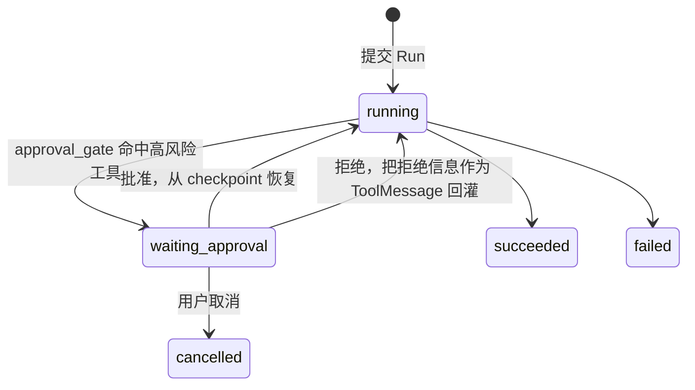

# 07 — 人工审批

## 前置依赖

阶段 [06-async-worker.md](06-async-worker.md) 的验收清单全部通过。特别确认：

- Checkpoint 持久化可用，崩溃恢复验证过
- `alembic check` 在 checkpoint 表存在时仍然干净
- 异步 Run 和事件流可用

本阶段与 08 / 09 / 10 相互独立，可以调整先后顺序。

MCP 复用 [05_1 的独立服务及使用契约](05_1-mcp-service.md#后续阶段的使用契约)。验收时把只读文档工具标记为需审批，确认批准前无 `tools/call`、拒绝后不执行、批准后可调用真实服务；无需添加有副作用的示例服务。MCP 的只读注解不能绕过平台审批标记。

## 本阶段目标

让 Agent 在执行高风险操作前停下来等人批准：

- `ApprovalRequest` 表
- 状态图里的审批闸门节点，用 LangGraph 的 `interrupt` 暂停
- 审批接口，批准后从断点继续、拒绝后把拒绝理由回灌给模型
- 前端审批中心和 Playground 里的内联审批

**审批机制是本项目最能体现"生产导向"的功能。** 它把阶段 06 的 checkpoint 从"崩溃恢复"这个被动用途，变成了"主动暂停与恢复"这个业务能力。用同一套基础设施实现两种价值，这是值得在简历和演示里强调的点。

## 本阶段不做什么

不做审批人指派和多级审批流（只有 Agent 的 owner 和 superuser 能审批）、不做审批超时自动拒绝（可选，见任务 7）。

---

## 审批流程



关键点：**拒绝不等于 Run 失败**。拒绝后 Agent 继续执行，只是它收到的是"这个操作被用户拒绝了"这条工具结果。模型可以据此换个方案或者告诉用户做不了。这比直接终止 Run 有用得多，也更符合真实的人机协作场景。

---

## 任务 1：ApprovalRequest 模型

新建 `backend/app/models/approval.py`：

```python
import enum
import uuid
from datetime import datetime
from typing import TYPE_CHECKING, Any

from sqlalchemy import DateTime
from sqlalchemy.dialects.postgresql import JSONB
from sqlmodel import Field, Relationship, SQLModel

from app.models.base import get_datetime_utc

if TYPE_CHECKING:
    from app.models.run import Run
    from app.models.user import User


class ApprovalStatus(str, enum.Enum):
    PENDING = "pending"
    APPROVED = "approved"
    REJECTED = "rejected"
    EXPIRED = "expired"


class ApprovalRequest(SQLModel, table=True):
    __tablename__ = "approval_request"

    id: uuid.UUID = Field(default_factory=uuid.uuid4, primary_key=True)
    run_id: uuid.UUID = Field(
        foreign_key="run.id", nullable=False, ondelete="CASCADE", index=True
    )
    # 冗余存 owner_id，让"我的待审批"列表不用 join run
    owner_id: uuid.UUID = Field(
        foreign_key="user.id", nullable=False, ondelete="CASCADE", index=True
    )

    tool_name: str = Field(max_length=64)
    tool_call_id: str = Field(max_length=128)
    tool_args: dict[str, Any] = Field(default_factory=dict, sa_type=JSONB)
    reason: str | None = Field(default=None, max_length=1000)

    status: ApprovalStatus = Field(default=ApprovalStatus.PENDING, index=True)
    resolved_by_id: uuid.UUID | None = Field(
        default=None, foreign_key="user.id", ondelete="SET NULL"
    )
    resolved_at: datetime | None = Field(
        default=None, sa_type=DateTime(timezone=True)  # type: ignore
    )
    rejection_reason: str | None = Field(default=None, max_length=1000)

    # 暂停时的 checkpoint，恢复执行时用
    checkpoint_id: str | None = Field(default=None, max_length=128)
    thread_id: str = Field(max_length=128)

    created_at: datetime | None = Field(
        default_factory=get_datetime_utc,
        sa_type=DateTime(timezone=True),  # type: ignore
    )

    run: "Run | None" = Relationship()


class ApprovalRequestPublic(SQLModel):
    id: uuid.UUID
    run_id: uuid.UUID
    owner_id: uuid.UUID
    tool_name: str
    tool_call_id: str
    tool_args: dict[str, Any]
    reason: str | None = None
    status: ApprovalStatus
    resolved_by_id: uuid.UUID | None = None
    resolved_at: datetime | None = None
    rejection_reason: str | None = None
    created_at: datetime | None = None
    # 非表字段，列表接口里填充，方便前端展示上下文
    agent_name: str | None = None


class ApprovalRequestsPublic(SQLModel):
    data: list[ApprovalRequestPublic]
    count: int


class ApprovalDecision(SQLModel):
    approved: bool
    rejection_reason: str | None = Field(default=None, max_length=1000)
```

要点：

- `tool_call_id` 必须存。恢复执行时要构造对应的 `ToolMessage`，它需要匹配原始 `tool_call` 的 id，否则模型会因为 tool_calls 和 tool 结果不配对而报错
- `resolved_by_id` 用 `SET NULL`：审批人账号被删不应该删掉审批记录，那是审计数据
- `owner_id` 冗余存储是有意的，"我的待审批"是高频查询
- `reason` 是**系统生成的**风险说明（例如 "This tool performs external write operations"），`rejection_reason` 是**用户填的**拒绝理由

更新 `models/__init__.py`，`conftest.py` 的 teardown 元组加 `ApprovalRequest`（放在 `Run` 之前）。

---

## 任务 2：迁移

```bash
cd backend
uv run alembic revision --autogenerate -m "Add approval request model"
```

检查：表建好、两个外键的 ondelete 正确、`status` 是 varchar、索引在位。

注意 `approval_request` 有两个指向 `user` 表的外键（`owner_id` 和 `resolved_by_id`）。SQLModel 在这种情况下**可能报关系歧义错误**。如果 `ApprovalRequest` 上要加指向 User 的 `Relationship`，必须显式指定 `sa_relationship_kwargs={"foreign_keys": "[ApprovalRequest.owner_id]"}`。

**最简单的规避方式是不定义指向 User 的关系**（上面的模型就没定义），需要用户信息时单独查。本项目不需要从审批记录反向遍历用户，所以不定义关系。

---

## 任务 3：审批闸门节点

### 3.1 判定哪些工具需要审批

`Tool` 表上阶段 05 已经有 `requires_approval` 字段，一直没用。现在启用它。

判定逻辑放在 `backend/app/agent/guardrail.py`：

```python
def tools_requiring_approval(
    *, tool_calls: list[dict[str, Any]], approval_required_names: set[str]
) -> list[dict[str, Any]]:
    """从待执行的工具调用里筛出需要审批的。"""
    return [tc for tc in tool_calls if tc["name"] in approval_required_names]


def describe_risk(tool_name: str, tool_type: ToolType) -> str:
    """生成给用户看的风险说明。"""
    if tool_type == ToolType.HTTP:
        return (
            f"'{tool_name}' performs an outbound HTTP request that may modify "
            "external state."
        )
    if tool_type == ToolType.MCP:
        return f"'{tool_name}' invokes an external MCP server."
    return f"'{tool_name}' was marked as requiring approval."
```

### 3.2 状态扩展

`app/agent/state.py` 的 `AgentState` 追加：

```python
    # 需要审批的工具名集合（图构建时注入，节点只读）
    # 注意：用 list 而不是 set，set 不能被 checkpoint 序列化
    approval_required_tools: list[str]
```

**不能用 `set`。** LangGraph 的 checkpoint 用 msgpack 序列化，`set` 不在支持的类型里，会在写 checkpoint 时报错。这个坑很隐蔽，因为无 checkpoint 的同步路径下 `set` 工作正常，只在异步路径才暴露。

### 3.3 闸门节点

`app/agent/nodes.py` 新增：

```python
from langgraph.types import interrupt


async def approval_gate(state: AgentState) -> dict[str, object]:
    """
    在执行工具前检查是否需要审批。

    命中高风险工具时调用 interrupt() 暂停整个图。恢复时 interrupt()
    返回外部传入的决策数据，节点据此决定放行还是构造拒绝结果。
    """
    last = state["messages"][-1]
    if not isinstance(last, AIMessage) or not last.tool_calls:
        return {}

    required = set(state["approval_required_tools"])
    pending = [tc for tc in last.tool_calls if tc["name"] in required]
    if not pending:
        return {}

    # interrupt 会抛出特殊异常暂停图执行；恢复时从这里继续，
    # 返回值是 Command(resume=...) 里传入的数据。
    decisions = interrupt(
        {
            "type": "tool_approval",
            "tool_calls": [
                {"id": tc["id"], "name": tc["name"], "args": tc["args"]}
                for tc in pending
            ],
        }
    )

    # decisions 形如 {"<tool_call_id>": {"approved": bool, "reason": str | None}}
    rejected_messages: list[BaseMessage] = []
    for tc in pending:
        decision = decisions.get(tc["id"], {})
        if not decision.get("approved", False):
            reason = decision.get("reason") or "Rejected by user"
            rejected_messages.append(
                ToolMessage(
                    content=(
                        f"Tool call was rejected by the user. Reason: {reason}. "
                        "Do not retry this exact call. Consider an alternative "
                        "approach or tell the user what you cannot do."
                    ),
                    tool_call_id=tc["id"],
                    name=tc["name"],
                )
            )

    return {"messages": rejected_messages} if rejected_messages else {}
```

要点：

- `interrupt` 从 `langgraph.types` 引入。**这是较新的 LangGraph API**，如果当前版本没有，退化方案见任务 3.5
- 拒绝的工具调用**必须生成对应的 `ToolMessage`**，`tool_call_id` 匹配原调用。少了它，下一次模型调用会因为 tool_calls 没有配对结果而报错（OpenAI 兼容接口对此严格）
- `ToolMessage` 的内容要**明确告诉模型不要重试同样的调用**。不加这句，模型经常会立刻再调一次同样的工具，陷入审批循环
- 批准的工具调用不在这里执行，闸门只是放行，后面的 `tools` 节点正常执行它们
- 被拒绝的工具调用仍然会被 `tools` 节点看到（它们还在 AIMessage 的 tool_calls 里）。**`ToolNode` 会重复执行它们**，这是个问题，见 3.4

### 3.4 处理被拒绝的调用不能被执行

`ToolNode` 读的是最后一条 AIMessage 的 `tool_calls`，它不知道哪些被拒绝了。如果闸门只是追加 `ToolMessage`，`ToolNode` 仍然会把所有工具都跑一遍，包括被拒绝的。

解决方式是**用自定义工具节点替代 `ToolNode`**，它跳过已经有 `ToolMessage` 结果的调用：

```python
async def execute_tools(state: AgentState, *, tools: list[StructuredTool]) -> dict:
    """
    执行工具调用，跳过已经有结果的（被审批拒绝的）。

    替代 langgraph.prebuilt.ToolNode，因为需要跳过被拒绝的调用。
    """
    last_ai = _last_ai_message(state["messages"])
    if last_ai is None or not last_ai.tool_calls:
        return {}

    # 收集已有结果的 tool_call_id
    resolved_ids = {
        m.tool_call_id
        for m in state["messages"]
        if isinstance(m, ToolMessage) and m.tool_call_id
    }

    tool_map = {t.name: t for t in tools}
    results: list[BaseMessage] = []

    async def _run_one(tc: dict[str, Any]) -> BaseMessage:
        tool = tool_map.get(tc["name"])
        if tool is None:
            return ToolMessage(
                content=f"Unknown tool: {tc['name']}",
                tool_call_id=tc["id"],
                name=tc["name"],
            )
        output = await tool.ainvoke(tc["args"])
        return ToolMessage(
            content=str(output), tool_call_id=tc["id"], name=tc["name"]
        )

    to_run = [tc for tc in last_ai.tool_calls if tc["id"] not in resolved_ids]
    if to_run:
        results = list(await asyncio.gather(*(_run_one(tc) for tc in to_run)))

    return {"messages": results}
```

`asyncio.gather` 保留了 `ToolNode` 的并发执行行为。

**这个替换会影响阶段 05 的测试**，因为节点实现变了。跑一遍阶段 05 的 `test_graph_tools.py` 确认还通过，`astream_events` 的 `on_tool_start` / `on_tool_end` 事件仍然会产出（因为 `tool.ainvoke` 内部会发这些事件）。如果事件没了，需要手工发布工具事件。

### 3.5 如果 `interrupt()` 不可用

老版本 LangGraph 只支持编译期的 `interrupt_before=["node_name"]`。退化方案：

```python
app = build_agent_graph(tools).compile(
    checkpointer=checkpointer, interrupt_before=["execute_tools"]
)
```

这样**每次**工具执行前都会暂停。然后在执行循环里判断：如果暂停点的工具调用都不需要审批，立刻用 `ainvoke(None, config)` 继续；需要审批才真正停下来建 `ApprovalRequest`。

这个方案多一次数据库往返和一次图恢复，但不需要新 API。如果走这条路，在偏差记录里写明，并且 3.3 的 `approval_gate` 节点不需要了，判定逻辑移到执行循环里。

先试 `interrupt()`，不行再退化。

### 3.6 图结构

```python
def build_agent_graph(tools=None, *, with_approval: bool = False) -> StateGraph:
    graph = StateGraph(AgentState)
    graph.add_node("call_model", _call_model)
    graph.add_edge(START, "call_model")

    if not tools:
        graph.add_edge("call_model", END)
        return graph

    graph.add_node("execute_tools", _execute_tools)
    if with_approval:
        graph.add_node("approval_gate", approval_gate)
        graph.add_conditional_edges(
            "call_model", should_continue, {"tools": "approval_gate", END: END}
        )
        graph.add_edge("approval_gate", "execute_tools")
    else:
        graph.add_conditional_edges(
            "call_model", should_continue, {"tools": "execute_tools", END: END}
        )
    graph.add_edge("execute_tools", "call_model")
    return graph
```

`with_approval` 由"这个版本绑定的工具里是否有 `requires_approval`"决定，在服务层算好传进来。没有高风险工具时不插闸门节点，省一次节点开销。

`KNOWN_NODE_NAMES` 更新为 `{"call_model", "execute_tools", "approval_gate"}`。注意节点从 `tools` 改名成 `execute_tools`，前端的节点名展示和阶段 05 的测试都要同步改。

---

## 任务 4：执行层集成

### 4.1 检测暂停

`interrupt()` 触发后，`astream_events` 的迭代会结束，图的状态变成"有 pending interrupt"。检测方式：

```python
        state = await app.aget_state(config)
        if state.next:          # 非空表示图还没跑完，停在某个节点前
            interrupts = state.tasks[0].interrupts if state.tasks else ()
            if interrupts:
                await _create_approval_requests(
                    session=session,
                    run=run,
                    interrupt_value=interrupts[0].value,
                    checkpoint_id=state.config["configurable"].get("checkpoint_id"),
                    thread_id=thread_id,
                )
                run.status = RunStatus.WAITING_APPROVAL
                await _emit(
                    RunEventType.APPROVAL_REQUESTED,
                    {"tool_calls": interrupt_value["tool_calls"]},
                )
                await session.commit()
                return run
```

`state.next` 和 `state.tasks` 的具体结构依赖 LangGraph 版本。**写代码前先在 REPL 里打印一次 `aget_state` 的返回值**，确认字段名：

```bash
cd backend
uv run python -c "
# 构造一个会 interrupt 的图，跑一次，打印 state
# 把实际结构记录到本文档的偏差记录里
"
```

这一步不要省，各版本之间这块 API 变化较多。

### 4.2 恢复执行

新建 `resume_run_after_approval`（放在 `app/services/run_service.py`）：

```python
async def resume_run_after_approval(
    *, session: AsyncSession, run: Run, decisions: dict[str, dict[str, Any]]
) -> None:
    """
    审批完成后恢复执行。

    decisions 的 key 是 tool_call_id，值是 {"approved": bool, "reason": str|None}。
    通过 Command(resume=...) 把决策传回 interrupt() 的调用点。
    """
    config = {"configurable": {"thread_id": run.thread_id}}
    async with checkpointer_context() as checkpointer:
        app = compile_agent_graph(
            tools=tools, checkpointer=checkpointer, with_approval=True
        )
        async for event in app.astream_events(
            Command(resume=decisions), config=config, version="v2"
        ):
            ...
```

`Command` 从 `langgraph.types` 引入。`Command(resume=value)` 让 `interrupt()` 返回 `value`。

**恢复必须重新加载工具**。工具对象是闭包捕获的，不在 checkpoint 里，新进程恢复时必须重新 `load_tools_for_version`。

恢复可能又碰到下一个审批点（模型第二轮又调了高风险工具），所以恢复逻辑要和首次执行共用同一套"检测暂停"代码。把 4.1 和主执行循环抽成一个函数，两边都调。

### 4.3 恢复在哪个进程执行

审批接口是 API 进程处理的，但恢复执行可能很长。两个选择：

1. 在 API 进程里同步恢复（简单，但审批接口会阻塞）
2. 入队让 worker 恢复（一致，但要多一个任务函数）

**选 2**。审批接口只改数据库状态 + 入队，立刻返回。新增 arq 任务：

```python
async def resume_run_task(ctx: dict[str, Any], run_id: str) -> dict[str, Any]:
    """审批后恢复执行。"""
```

注册到 `WorkerSettings.functions`。

同步流式路径（Playground）的审批怎么办？Playground 里的 Run 也走异步恢复，前端在审批后重新订阅 `GET /runs/{id}/stream` 继续看进度。这让两条路径在审批场景下统一了，实现上更简单。

---

## 任务 5：路由

新建 `backend/app/api/routes/approvals.py`，`tags=["approvals"]`。

| 方法 | 路径 | response_model | session | 说明 |
|------|------|----------------|---------|------|
| GET | `/approvals/` | `ApprovalRequestsPublic` | sync | 列表，默认只返回 pending，可按 status 过滤 |
| GET | `/approvals/{id}` | `ApprovalRequestPublic` | sync | 详情 |
| POST | `/approvals/{id}/decide` | `ApprovalRequestPublic` | **async** | 批准或拒绝 |

### decide 的实现要点

```python
@router.post("/{id}/decide", response_model=ApprovalRequestPublic)
async def decide_approval(
    *,
    session: AsyncSessionDep,
    current_user: CurrentUser,
    id: uuid.UUID,
    decision: ApprovalDecision,
) -> Any:
    """
    Approve or reject a pending tool call and resume the run.
    """
```

步骤：

1. 查 ApprovalRequest，校验 `owner_id == current_user.id` 或 superuser
2. **状态必须是 `pending`**，否则返回 409（防止重复审批，这是并发点）
3. 拒绝时 `rejection_reason` 必填，缺了返回 422
4. 更新 `status`、`resolved_by_id`、`resolved_at`
5. 查同一个 Run 下所有 pending 的审批请求。**全部决策完成才恢复执行**，还有 pending 的就只更新这一条然后返回
6. 全部完成后，组装 `decisions` 字典，把 Run 状态改回 `running`，入队 `resume_run_task`
7. 记一条 `approval_resolved` 事件

第 5 步很重要：一轮工具调用可能有多个需要审批（模型并行调了三个工具），必须等全部决策完才能恢复。UI 上要把同一个 Run 的多个请求分组展示。

原子性：状态检查和更新之间有竞态。用 `SELECT ... FOR UPDATE` 锁行：

```python
    result = await session.execute(
        select(ApprovalRequest).where(ApprovalRequest.id == id).with_for_update()
    )
```

### 取消待审批的 Run

阶段 06 的 `/runs/{id}/cancel` 要支持 `waiting_approval` 状态：把 Run 改成 `cancelled`，把所有 pending 的审批请求改成 `expired`。

---

## 任务 6：Agent 配置里的审批开关

用户需要能控制哪些工具要审批。两个层级：

1. **工具级**：`Tool.requires_approval`，阶段 05 已有。在 Tools 页的创建/编辑表单里加一个开关
2. **Agent 级覆盖**：某些 Agent 可能想对本来不需审批的工具也要审批

第二个通过 `AgentToolBinding.config_override` 实现，约定一个特殊 key：

```json
{ "requires_approval": true }
```

合并规则：`binding.config_override.get("requires_approval", tool.requires_approval)`。

`AgentSnapshot` 里也要能表达这个覆盖。给它加：

```python
    tool_approval_overrides: dict[str, bool] = Field(default_factory=dict)
```

key 是工具 id 的字符串形式。**记得给默认值**，旧快照要能读。

如果觉得这层覆盖是过度设计，可以只做工具级，在偏差记录里写明。工具级已经能满足演示需求。

---

## 任务 7：审批超时（可选）

待审批的 Run 会一直占着 `waiting_approval` 状态。如果用户再也不回来处理，它就永远挂着。

加一个 arq cron 任务处理：

```python
async def expire_stale_approvals(ctx: dict[str, Any]) -> int:
    """
    把超过 24 小时未处理的审批请求标记为 expired，
    并把对应的 Run 标记为 cancelled。
    """
```

`APPROVAL_TIMEOUT_HOURS` 加到 `config.py`，默认 24。注册到 `WorkerSettings.cron_jobs`，每小时跑一次。

这个功能在演示里意义不大，但它是"生产导向"的体现。时间紧可以跳过，在偏差记录里写明。

---

## 任务 8：测试

### 8.1 `backend/tests/agent/test_approval_gate.py`

- 最后一条消息没有 tool_calls 时，闸门直接返回空 dict（不触发 interrupt）
- 所有工具都不需审批时，闸门不触发 interrupt
- 有需审批工具时触发 interrupt（用 `pytest.raises` 捕获 LangGraph 的 interrupt 异常，具体异常类型看版本）
- **`approval_required_tools` 用 list 而不是 set**：写一条测试断言 state 能被 checkpoint 序列化。构造方式是跑一次带 checkpointer 的图然后读 checkpoint

### 8.2 `backend/tests/agent/test_execute_tools.py`

替换 `ToolNode` 之后的节点要重测：

- 正常执行所有工具调用
- **跳过已有 `ToolMessage` 结果的调用**（这是替换 `ToolNode` 的唯一理由，必须测）
- 未知工具名返回说明性的 `ToolMessage` 而不是抛异常
- 多个工具并发执行（用带延迟的假工具，断言总耗时接近单个而不是累加）
- 阶段 05 的 `test_graph_tools.py` 仍然通过

### 8.3 `backend/tests/services/test_approval_flow.py`

这是本阶段最重要的测试，完整走一遍审批流程：

**批准路径**：

1. 建一个绑定了 `requires_approval=True` 工具的 agent 版本
2. 假模型返回一个该工具的 tool_call
3. 执行 Run，断言 Run 状态是 `waiting_approval`，`approval_request` 表里有一条 pending
4. 断言 `run_event` 里有 `approval_requested`
5. 调 decide 批准
6. 执行 `resume_run_task`
7. 断言 Run 最终 `succeeded`，且**工具真的被执行了**（用一个会记录调用的假工具断言）

**拒绝路径**：

1. 同样走到 `waiting_approval`
2. 调 decide 拒绝，带 `rejection_reason="too risky"`
3. 恢复执行
4. 断言 Run 最终 `succeeded`（**不是 failed**）
5. 断言**工具没有被执行**
6. 断言 messages 里有一条 `ToolMessage` 包含 "rejected" 和 "too risky"
7. 断言模型第二轮收到了这条 ToolMessage（用假模型记录收到的消息）

**部分审批**：

1. 假模型一轮返回两个需审批的 tool_call
2. 断言建了两条 ApprovalRequest
3. 只决策一条，断言 Run 仍然是 `waiting_approval`，没有入队恢复任务
4. 决策第二条，断言 Run 变 `running` 并入队

### 8.4 `backend/tests/api/routes/test_approvals.py`

- 列表默认只返回 pending
- 别人的审批请求返回 403
- 重复决策同一条返回 409
- 拒绝时缺 `rejection_reason` 返回 422
- 取消 `waiting_approval` 的 Run 后，它的审批请求变 `expired`
- `expire_stale_approvals` 能把超时的请求标记为 expired 并取消 Run

### 8.5 手动端到端验证

```bash
# 1. 建一个 HTTP 工具并勾选 requires_approval
# 2. 绑到 agent，发布版本
# 3. 在 Playground 提问，触发工具调用
# 4. 确认对话停住，出现审批卡片
# 5. 点批准，确认执行继续并给出最终回复
# 6. 换一次，点拒绝并填理由
# 7. 确认模型收到拒绝信息并给出替代回答（例如"抱歉，我无法完成这个操作"）
```

第 7 步是本阶段最有说服力的演示效果。

---

## 任务 9：前端

### 9.1 审批中心

新建 `frontend/src/routes/_layout/approvals.tsx`。

按 Run 分组展示 pending 请求。每组一个卡片：

```
┌──────────────────────────────────────────────┐
│ Agent: weather-bot          Run: a3f2...     │
│ 2 tool calls awaiting approval               │
│                                              │
│  🔧 update_calendar                          │
│     { "date": "2026-09-15", "title": "..." } │
│     ⚠ Performs an outbound HTTP request      │
│     [ Approve ]  [ Reject ]                  │
│                                              │
│  🔧 send_email                               │
│     { "to": "...", "body": "..." }           │
│     [ Approve ]  [ Reject ]                  │
│                                              │
│  [ Approve all ]  [ Reject all ]             │
└──────────────────────────────────────────────┘
```

要点：

- `tool_args` 用格式化的 JSON 展示，参数值可能很长，需要折叠
- 拒绝时弹出 Dialog 要求填理由（必填）
- "Approve all" / "Reject all" 批量操作，避免逐个点
- 还有未决策的请求时，卡片上显示"等待其余 N 项决策后恢复执行"

侧栏加导航，**带未处理数量的 Badge**：

```typescript
{ icon: ShieldCheck, title: "Approvals", path: "/approvals", badge: pendingCount },
```

`Main.tsx` 的 `Item` 类型需要加可选的 `badge` 字段并渲染。pendingCount 用一个轻量 query 定时拉：

```typescript
useQuery({
  queryKey: ["approvals", "pending-count"],
  queryFn: async () =>
    (await ApprovalsService.readApprovals({ query: { status: "pending", limit: 1 } })).data.count,
  refetchInterval: 30_000,
})
```

这个 Badge 是"平台在等你操作"的直观信号，值得做。

### 9.2 Playground 内联审批

Playground 里收到 `approval_requested` 事件时，在对话流里插入一个审批卡片（不用跳到审批中心）。

批准或拒绝后：

1. 调 decide 接口
2. 重新订阅 `GET /runs/{run_id}/stream` 继续接收后续事件
3. 卡片变成已决策状态（显示决策结果和决策人）

**重新订阅是关键**。首次的 SSE 流在 Run 进入 `waiting_approval` 时就结束了，恢复执行是新一轮事件，必须重新连。

Stream 从头读（`last_id="0"`）会重放之前的事件，前端要去重。用事件在 stream 里的顺序 index 做去重，或者订阅时从上次收到的最后一个 id 开始。**给 `GET /runs/{id}/stream` 加一个 `last_event_id` query 参数**让前端能指定起点，这是更干净的做法。

### 9.3 Run 详情页

轨迹里展示 `approval_requested` 和 `approval_resolved` 事件，用不同的图标和颜色（黄色/绿色/红色）区分。

Run 状态是 `waiting_approval` 时，详情页顶部显示醒目的提示条和跳转到审批的按钮。

### 9.4 Tools 页

创建/编辑表单加 "Requires approval" 开关，旁边一句说明："Agent will pause and wait for your approval before each call to this tool."

列表里 `requires_approval=true` 的工具显示一个盾牌图标。

---

## 阶段验收清单

- [x] `uv run alembic check` 输出 `No new upgrade operations detected.`；开发库和独立测试库均已验证。
- [x] 完整 pytest 通过，包括阶段 05 工具回归；最终 Linux 原始 test 脚本为 191 passed、10 deselected（集成单独运行）。
- [x] 批准路径测试通过，断言了工具真的被执行。
- [x] 拒绝路径测试通过，断言工具没有执行且 Run 为 `succeeded`，模型收到拒绝理由。
- [x] 部分审批测试通过；并发决策只入队一次，取消与决策竞争也有覆盖。
- [x] `approval_required_tools` 为 list，异步读取 checkpoint 验证序列化及 interrupt 内容。
- [x] Linux 原始 `bash scripts/lint.sh` 全绿；Windows 等价四项检查通过。
- [x] Linux 原始 `bash scripts/test.sh` 全绿，覆盖率 93%。
- [x] `bun run lint`、TypeScript/Vite 生产构建通过。
- [x] 任务 8.5 真实模型浏览器闭环通过；按 05_1 契约使用只读 MCP 代替 HTTP 演示，拒绝后模型解释原因并提供替代方案。
- [x] 浏览器验证 Badge 数量 2 → 1 → 0，以及批量批准/拒绝。
- [x] 真实模型同轮发出两个 calculator 调用，卡片按 Run 分组，全部决策后才恢复。
- [x] Playground 内联审批、刷新找回 pending、带游标续流及无重复工具事件均通过。
- [x] 浏览器取消待审批 Run 后请求变 `expired`。
- [x] 开发库及独立真实验收库无 queued/running/waiting_approval 遗留。
- [x] 独立验收库 pending 数量 0，终态 Run 对应的孤立 pending 数量 0。

---

## 常见坑

**`interrupt` import 失败**
LangGraph 版本不支持。用 3.5 的 `interrupt_before` 退化方案。

**`set` 不能被 checkpoint 序列化**
`approval_required_tools` 必须是 list。这个错误只在带 checkpointer 的路径出现，同步路径测不出来。

**恢复后模型报 tool_calls 没有配对结果**
被拒绝的工具调用必须有对应 `tool_call_id` 的 `ToolMessage`。少一个都会让 OpenAI 兼容接口报 400。

**模型被拒绝后立刻重试同样的调用**
`ToolMessage` 的内容里必须明确说"不要重试这个调用"。措辞要直接。

**被拒绝的工具还是被执行了**
`ToolNode` 不认识拒绝状态。必须换成任务 3.4 的自定义 `execute_tools` 节点。

**重复审批导致恢复执行跑两次**
decide 接口里必须检查 `status == pending` 并用 `FOR UPDATE` 锁行。

**Playground 审批后收到重复事件**
Stream 从头重放。给订阅接口加 `last_event_id` 参数。

**恢复执行时工具是空的**
工具对象是闭包捕获的，不在 checkpoint 里。恢复时必须重新 `load_tools_for_version`。

**`aget_state` 的返回结构与文档不符**
LangGraph 各版本差异较大。先在 REPL 里打印实际结构再写代码，并记到偏差记录里。

**节点改名导致前端显示异常**
`tools` 节点改名成 `execute_tools`，前端的节点名映射和 `KNOWN_NODE_NAMES` 都要改。

---

## 偏差记录

- 验收配套新增 `backend/tests/integration/test_approval_mcp.py`、`frontend/tests/approvals.spec.ts`，复用既有真实 MCP 服务 fixture；Run 列表增加可选 `conversation_id` 过滤，使刷新后的 Playground 能找回待审批 Run。没有修改用户环境文件。

- 2026-09-18 实施范围：配套修改 `models/run.py`（双向级联）、`services/tool_service.py`（读取审批标记）、`services/event_bus.py`（暂停及 SSE 游标）、`api/routes/conversations.py`（Playground checkpoint 执行及待审批会话互斥）、生成客户端、现有 SSE/运行状态组件和相关测试；新增 `tests/utils/approval.py` 及审批 UI 组件。均直接服务本阶段审批闭环。
- 本阶段采用工具级 `requires_approval`，不实现可选 Agent 级覆盖和自动审批超时；取消会使未决审批过期。
- 本机探针确认 `interrupt` / `Command` 可用：`StateSnapshot.next=('gate',)`，中断值位于 `state.tasks[0].interrupts[0].value`，checkpoint ID 位于 `state.config['configurable']['checkpoint_id']`；恢复后节点正常完成。

- 执行路径：有审批工具的同步 Run 与 Playground 复用 checkpoint 执行器；无审批工具保留原同步路径。暂停后由 `resume_run_task` 在 worker 中重新加载工具和数据库决策，使用 `Command(resume=...)` 恢复。恢复又遇到审批时复用同一逻辑。
- 并发与审计：决策先锁 Run 再锁 ApprovalRequest，避免同轮不同请求各自锁行却漏触发恢复；请求按 `(run_id, checkpoint_id, tool_call_id)` 唯一，保留每轮决策。取消使 pending 过期，过期 checkpoint 不能直接恢复执行工具，须选择从头重跑。队列不可用时保留已保存决策、Run 标记 failed 并返回 503，可重试 Run 恢复。
- 恢复任务重投以稳定的 Run 重试次数识别任务；不以不断推进的当前 checkpoint ID 判定任务过时。测试在获批工具结果持久化后取消执行协程，再用原任务 ID 重投，确认成功且工具仅调用一次。
- Redis Stream 将事件 ID 放入 SSE `id` 和 payload 的 `event_id`；订阅接受 `last_event_id`。重放遇到旧 `approval_requested` 不提前结束，读完事件后根据数据库 waiting 状态结束，避免恢复后的订阅卡在旧暂停点。
- Windows 使用现有脚本内部等价命令生成 OpenAPI/客户端（设置 `FASTAPI_ENV=development`），生成客户端及路由树未手改。`git diff --check` 的两条尾部空白来自 `sdk.gen.ts` 生成器，按仓库约定保留。

### 实际验收（2026-09-18）

| 验证项 | 实际结果 |
|---|---|
| 数据库迁移 | `1b01bc705599`，仅新增 approval_request；JSONB、varchar(32)、CASCADE/SET NULL、索引和唯一约束已检查。测试库 `head → dcfa86559b4f → head` 往返通过；checkpoint 表存在时 Alembic check 无差异 |
| 隔离 | 自动测试使用 `agenthub_phase07_test` / Redis DB 15；真实验收使用 `agenthub_phase07_live` / Redis DB 14；未清理开发库数据、未修改用户 .env |
| 后端检查 | mypy 检查 72 个文件；ty、Ruff check/format 全通过。Linux 容器执行原始 lint/test 脚本，最终 191 passed、无 skip，覆盖率 93% |
| Windows | 完整普通回归 187 passed、2 skipped，后补 SSE 游标和审批重投测试通过；Windows 的两项链接权限跳过在 Linux 实际通过 |
| MCP 集成 | `MCP_LIVE_MODEL_TEST=1 uv run pytest tests/integration -m mcp_integration -q`：10 passed；其中审批两项包装观察真实 SDK call_tool，并继续调用真实服务，证明批准前及拒绝后无 tools/call，批准后输出有效 |
| 浏览器 | 审批/SSE 首轮 7 passed，分组/批量/真实同轮双调用补验 3 passed，既有 Agents/Runs/Tools 回归 7 passed（各次含登录准备） |
| 构建 | 前端 TypeScript/Vite 构建、Docker backend 镜像构建通过；未进行生产部署或 Git 提交 |
| 实际状态 | 真实库 succeeded=3、cancelled=1；approval approved=2、rejected=2、expired=1；无 pending 和限流 slot 残留。开发库仍 succeeded=29、failed=4、cancelled=9 |

真实模型使用 `.env` 配置的 `deepseek-flash` / `https://api.deepseek.com`，API/worker 仅信任 `http://127.0.0.1:3007/mcp`；未开启全局私网或 stdio 豁免。单独启动本机 API（8007）、worker 和 MCP（3007）完成验证，未替换开发 Compose 后端。批量启动命令曾被自动审批检查拦截（无具体原因），改为各个可追踪的工具进程后成功。

- 批准：`d836c8b4-7a29-4ec0-867f-4cf4706052e5`，审批前零工具调用，批准后读取 06 文档并回答。
- 拒绝：`4443667c-94c3-4a66-8758-652ac935070b`，零工具调用，模型说明「too risky，请不要读取文档」并给出粘贴内容等替代方案，Run succeeded。
- 取消：`1eb5d86a-eb85-4750-acae-a3bb64ccd6bd`，Run cancelled、审批 expired。
- 同轮双调用：`21fb25ce-36bb-4207-9808-950ccba3e975`，第一项批准后仍 waiting，第二项拒绝后恢复，仅一项工具执行，Run succeeded。

截图已实际打开检查，位于 `frontend/test-results/phase07-browser/` 与 `frontend/test-results/phase07-parallel/`；既有页面回归输出位于 `frontend/test-results/phase07-regression/`。真实验收数据保留供复核。崩溃发生在外部工具完成但 checkpoint 未提交之间，仍可能重放调用，沿用阶段 06 的边界，不承诺 exactly-once。
