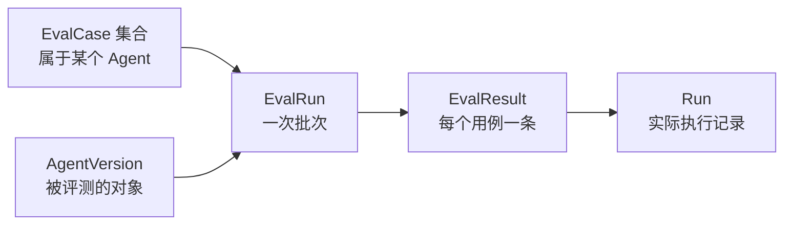

# 09 — 运行评测

## 前置依赖

阶段 [06-async-worker.md](06-async-worker.md) 的验收清单全部通过。特别确认：

- arq worker 可用（批量评测是后台任务）
- Run 的 token 和费用统计准确（评测的成本对比依赖它）
- Agent 版本机制可用（评测的意义就在于跨版本对比）

本阶段与 07 / 08 / 10 相互独立。

涉及 MCP 的评测复用 [05_1 的文档服务](05_1-mcp-service.md#后续阶段的使用契约)，固定文档语料版本并断言工具名、文档 ID；服务不可用应记录为评测失败，不能静默跳过或仅凭模型文本判定工具成功。

## 本阶段目标

回答"我改了 prompt，到底变好了还是变坏了"这个问题：

- `EvalCase` / `EvalRun` / `EvalResult` 三张表
- 多种断言方式：精确匹配、包含、正则、JSON 字段、工具调用检查、LLM 评分
- 批量执行，跨版本对比质量、延迟和成本
- 结果对比页，并列展示两个版本的差异

**这一阶段是"Agent 工程化"最有说服力的部分。** 大多数 Agent 项目停在"能跑通"，能回答"改动是否让它变好"的项目少得多。

## 本阶段不做什么

不做数据集版本管理、不做人工标注界面、不做 A/B 流量分配。评测是离线的批量跑。

---

## 评测的核心概念

一次评测的结构：



关键设计：**每条 EvalResult 关联一个真实的 Run**。评测不是特殊的执行路径，它就是用 `trigger=eval` 跑一遍普通的 Run。这样：

- 评测的执行轨迹、token、费用统计全部复用已有机制，不用重写
- 出问题时能点进 Run 详情页看完整轨迹，排查极其方便
- 评测和生产用的是同一套代码，不会出现"评测通过但线上不行"

---

## 任务 1：数据模型

新建 `backend/app/models/eval.py`：

```python
import enum
import uuid
from datetime import datetime
from decimal import Decimal
from typing import TYPE_CHECKING, Any

from sqlalchemy import DateTime, Numeric
from sqlalchemy.dialects.postgresql import JSONB
from sqlmodel import Field, Relationship, SQLModel

from app.models.base import get_datetime_utc


class AssertionType(str, enum.Enum):
    EXACT = "exact"                 # 输出完全等于期望值
    CONTAINS = "contains"           # 输出包含期望值（不区分大小写）
    NOT_CONTAINS = "not_contains"   # 输出不包含某个值
    REGEX = "regex"                 # 输出匹配正则
    JSON_PATH = "json_path"         # 输出解析为 JSON 后某个路径的值等于期望
    TOOL_CALLED = "tool_called"     # 执行过程中调用了指定工具
    TOOL_NOT_CALLED = "tool_not_called"
    LLM_JUDGE = "llm_judge"         # 用模型打分，score >= threshold 视为通过
    MAX_DURATION_MS = "max_duration_ms"
    MAX_COST_USD = "max_cost_usd"


class EvalRunStatus(str, enum.Enum):
    QUEUED = "queued"
    RUNNING = "running"
    SUCCEEDED = "succeeded"
    FAILED = "failed"
    CANCELLED = "cancelled"


class EvalCaseBase(SQLModel):
    name: str = Field(min_length=1, max_length=255)
    description: str | None = Field(default=None, max_length=1000)
    input: dict[str, Any] = Field(default_factory=dict, sa_type=JSONB)
    expected_output: str | None = Field(default=None)
    assertions: list[dict[str, Any]] = Field(default_factory=list, sa_type=JSONB)
    tags: list[str] = Field(default_factory=list, sa_type=JSONB)
    is_active: bool = True


class EvalCaseCreate(EvalCaseBase):
    pass


class EvalCaseUpdate(SQLModel):
    name: str | None = Field(default=None, min_length=1, max_length=255)
    description: str | None = Field(default=None, max_length=1000)
    input: dict[str, Any] | None = None
    expected_output: str | None = None
    assertions: list[dict[str, Any]] | None = None
    tags: list[str] | None = None
    is_active: bool | None = None


class EvalCase(EvalCaseBase, table=True):
    __tablename__ = "eval_case"

    id: uuid.UUID = Field(default_factory=uuid.uuid4, primary_key=True)
    agent_id: uuid.UUID = Field(
        foreign_key="agent.id", nullable=False, ondelete="CASCADE", index=True
    )
    created_at: datetime | None = Field(
        default_factory=get_datetime_utc,
        sa_type=DateTime(timezone=True),  # type: ignore
    )
    updated_at: datetime | None = Field(
        default_factory=get_datetime_utc,
        sa_type=DateTime(timezone=True),  # type: ignore
    )


class EvalCasePublic(EvalCaseBase):
    id: uuid.UUID
    agent_id: uuid.UUID
    created_at: datetime | None = None
    updated_at: datetime | None = None


class EvalCasesPublic(SQLModel):
    data: list[EvalCasePublic]
    count: int


class EvalRunCreate(SQLModel):
    agent_version_id: uuid.UUID
    case_ids: list[uuid.UUID] | None = None   # None 表示跑该 agent 的全部启用用例
    tags: list[str] | None = None             # 按标签筛选用例
    note: str | None = Field(default=None, max_length=500)


class EvalRun(SQLModel, table=True):
    __tablename__ = "eval_run"

    id: uuid.UUID = Field(default_factory=uuid.uuid4, primary_key=True)
    owner_id: uuid.UUID = Field(
        foreign_key="user.id", nullable=False, ondelete="CASCADE", index=True
    )
    agent_version_id: uuid.UUID = Field(
        foreign_key="agent_version.id", nullable=False, ondelete="CASCADE", index=True
    )
    note: str | None = Field(default=None, max_length=500)

    status: EvalRunStatus = Field(default=EvalRunStatus.QUEUED, index=True)
    error: str | None = Field(default=None, max_length=2000)

    case_count: int = 0
    completed_count: int = 0
    passed_count: int = 0

    avg_duration_ms: int | None = None
    p95_duration_ms: int | None = None
    total_cost_usd: Decimal | None = Field(
        default=None, sa_type=Numeric(12, 6)  # type: ignore
    )
    total_prompt_tokens: int = 0
    total_completion_tokens: int = 0

    created_at: datetime | None = Field(
        default_factory=get_datetime_utc,
        sa_type=DateTime(timezone=True),  # type: ignore
    )
    started_at: datetime | None = Field(
        default=None, sa_type=DateTime(timezone=True)  # type: ignore
    )
    finished_at: datetime | None = Field(
        default=None, sa_type=DateTime(timezone=True)  # type: ignore
    )

    results: list["EvalResult"] = Relationship(
        back_populates="eval_run", cascade_delete=True
    )


class EvalRunPublic(SQLModel):
    id: uuid.UUID
    owner_id: uuid.UUID
    agent_version_id: uuid.UUID
    note: str | None = None
    status: EvalRunStatus
    error: str | None = None
    case_count: int
    completed_count: int
    passed_count: int
    avg_duration_ms: int | None = None
    p95_duration_ms: int | None = None
    total_cost_usd: Decimal | None = None
    total_prompt_tokens: int
    total_completion_tokens: int
    created_at: datetime | None = None
    started_at: datetime | None = None
    finished_at: datetime | None = None
    # 非表字段
    agent_name: str | None = None
    agent_version_number: int | None = None
    pass_rate: float | None = None


class EvalRunsPublic(SQLModel):
    data: list[EvalRunPublic]
    count: int


class EvalResult(SQLModel, table=True):
    __tablename__ = "eval_result"

    id: uuid.UUID = Field(default_factory=uuid.uuid4, primary_key=True)
    eval_run_id: uuid.UUID = Field(
        foreign_key="eval_run.id", nullable=False, ondelete="CASCADE", index=True
    )
    eval_case_id: uuid.UUID = Field(
        foreign_key="eval_case.id", nullable=False, ondelete="CASCADE", index=True
    )
    # 指向实际执行的 Run，可以点进去看完整轨迹
    run_id: uuid.UUID | None = Field(
        default=None, foreign_key="run.id", ondelete="SET NULL"
    )

    passed: bool = False
    score: float | None = None
    actual_output: str | None = None
    # 每条断言的结果明细
    assertion_results: list[dict[str, Any]] = Field(
        default_factory=list, sa_type=JSONB
    )
    error: str | None = Field(default=None, max_length=2000)

    duration_ms: int | None = None
    prompt_tokens: int = 0
    completion_tokens: int = 0
    cost_usd: Decimal | None = Field(
        default=None, sa_type=Numeric(12, 6)  # type: ignore
    )

    created_at: datetime | None = Field(
        default_factory=get_datetime_utc,
        sa_type=DateTime(timezone=True),  # type: ignore
    )

    eval_run: EvalRun | None = Relationship(back_populates="results")


class EvalResultPublic(SQLModel):
    id: uuid.UUID
    eval_run_id: uuid.UUID
    eval_case_id: uuid.UUID
    run_id: uuid.UUID | None = None
    passed: bool
    score: float | None = None
    actual_output: str | None = None
    assertion_results: list[dict[str, Any]]
    error: str | None = None
    duration_ms: int | None = None
    prompt_tokens: int
    completion_tokens: int
    cost_usd: Decimal | None = None
    # 非表字段，展示用
    case_name: str | None = None


class EvalResultsPublic(SQLModel):
    data: list[EvalResultPublic]
    count: int
```

### 几个设计要点

**`EvalCase` 属于 `Agent` 而不是 `AgentVersion`**。用例是对"这个 Agent 应该有什么行为"的描述，跨版本稳定。这正是跨版本对比的前提 —— 同一批用例跑不同版本。

**`assertions` 是 JSONB 列表**，每条形如：

```json
[
  { "type": "contains", "value": "56088" },
  { "type": "tool_called", "value": "calculator" },
  { "type": "max_duration_ms", "value": 10000 },
  { "type": "llm_judge", "value": "回答是否正确计算了乘法", "threshold": 0.7 }
]
```

**全部断言通过才算 `passed = True`**。部分通过记录在 `assertion_results` 里供排查。

**`score` 与 `passed` 分开**。`passed` 是布尔判定，`score` 是连续值（LLM judge 的评分，或者通过的断言比例）。对比两个版本时 `score` 比 `passed` 更能看出细微改进。

**`completed_count` 单独记录**，让前端能显示"12 / 50 已完成"的进度。

**`run_id` 用 `SET NULL`**：Run 可能被清理（长期数据保留策略），但评测结果要留着。

更新 `models/__init__.py`，`conftest.py` teardown 元组加 `(EvalResult, EvalRun, EvalCase)`，注意 `EvalResult` 要在 `Run` 之后删还是之前？`EvalResult.run_id` 是 SET NULL 所以顺序不敏感，但保持"子表在前"的规则：`EvalResult` 放最前面。

---

## 任务 2：迁移

```bash
cd backend
uv run alembic revision --autogenerate -m "Add eval case run and result models"
```

检查三张表、外键 ondelete、枚举是 varchar、`Numeric(12, 6)`、索引。

`eval_result` 有三个外键（eval_run、eval_case、run），确认 autogenerate 都生成了。

---

## 任务 3：断言评估器

新建 `backend/app/agent/evaluation.py`。

### 3.1 结构

```python
@dataclass
class AssertionOutcome:
    type: str
    passed: bool
    expected: Any
    actual: Any
    message: str | None = None

    def to_dict(self) -> dict[str, Any]:
        return {
            "type": self.type,
            "passed": self.passed,
            "expected": _truncate(self.expected),
            "actual": _truncate(self.actual),
            "message": self.message,
        }


@dataclass
class EvaluationContext:
    """评估一条用例时可用的全部信息。"""

    output: str
    run: Run
    tool_names_called: list[str]
    duration_ms: int
    cost_usd: Decimal | None
```

`tool_names_called` 从 `run_event` 表里查 `tool_called` 事件得到。这是 `tool_called` 断言的数据来源，也说明了为什么事件要落库。

### 3.2 各类断言

```python
async def evaluate_assertion(
    *, assertion: dict[str, Any], ctx: EvaluationContext
) -> AssertionOutcome:
    """
    评估单条断言。未知类型返回未通过而不是抛异常，
    避免一条坏配置让整个评测批次崩掉。
    """
    kind = assertion.get("type")
    expected = assertion.get("value")

    if kind == AssertionType.EXACT.value:
        actual = ctx.output.strip()
        return AssertionOutcome(
            type=kind, passed=actual == str(expected).strip(),
            expected=expected, actual=actual,
        )

    if kind == AssertionType.CONTAINS.value:
        passed = str(expected).lower() in ctx.output.lower()
        return AssertionOutcome(
            type=kind, passed=passed, expected=expected, actual=ctx.output
        )

    if kind == AssertionType.NOT_CONTAINS.value:
        passed = str(expected).lower() not in ctx.output.lower()
        return AssertionOutcome(...)

    if kind == AssertionType.REGEX.value:
        try:
            passed = re.search(str(expected), ctx.output, re.DOTALL) is not None
        except re.error as exc:
            return AssertionOutcome(
                type=kind, passed=False, expected=expected, actual=None,
                message=f"Invalid regex: {exc}",
            )
        return AssertionOutcome(...)

    if kind == AssertionType.TOOL_CALLED.value:
        passed = str(expected) in ctx.tool_names_called
        return AssertionOutcome(
            type=kind, passed=passed, expected=expected,
            actual=ctx.tool_names_called,
        )

    if kind == AssertionType.MAX_DURATION_MS.value:
        passed = ctx.duration_ms <= int(expected)
        return AssertionOutcome(...)

    if kind == AssertionType.MAX_COST_USD.value:
        if ctx.cost_usd is None:
            return AssertionOutcome(
                type=kind, passed=False, expected=expected, actual=None,
                message="Cost is unknown for this model",
            )
        passed = ctx.cost_usd <= Decimal(str(expected))
        return AssertionOutcome(...)

    if kind == AssertionType.LLM_JUDGE.value:
        return await _llm_judge(assertion=assertion, ctx=ctx)

    if kind == AssertionType.JSON_PATH.value:
        return _json_path(assertion=assertion, ctx=ctx)

    return AssertionOutcome(
        type=str(kind), passed=False, expected=expected, actual=None,
        message=f"Unknown assertion type: {kind}",
    )
```

**正则要注意 ReDoS**。用户提供的正则可能有灾难性回溯，`re.search` 会卡住。Python 标准库没有超时机制，缓解方式：

- 限制正则长度（`len(pattern) <= 200`）
- 在单独的线程里跑并用超时（复杂，收益有限）
- 简单方案：文档里说明这是已知限制，并且因为评测跑在 worker 里、有 `job_timeout` 兜底，最坏情况是这个评测批次超时失败

选简单方案，但要在代码注释里写明。

**`max_cost_usd` 在成本未知时返回未通过**。这比默认通过安全 —— 用了未知定价的模型时，成本断言给不出结论，应该让人注意到。

### 3.3 LLM as judge

```python
JUDGE_PROMPT = """You are evaluating an AI assistant's response.

Criterion: {criterion}

{expected_block}

Actual response:
{actual}

Rate how well the response satisfies the criterion on a scale of 0.0 to 1.0.
Respond with ONLY a JSON object: {{"score": <float>, "reason": "<brief explanation>"}}
"""


async def _llm_judge(
    *, assertion: dict[str, Any], ctx: EvaluationContext
) -> AssertionOutcome:
    criterion = str(assertion.get("value", ""))
    threshold = float(assertion.get("threshold", 0.7))
    expected = assertion.get("expected_output")

    expected_block = (
        f"Expected response (reference):\n{expected}\n" if expected else ""
    )
    prompt = JUDGE_PROMPT.format(
        criterion=criterion, expected_block=expected_block, actual=ctx.output
    )

    try:
        chat = get_provider().get_chat_model(
            model=settings.EVAL_JUDGE_MODEL, temperature=0
        )
        response = await chat.ainvoke([HumanMessage(content=prompt)])
        parsed = json.loads(_extract_json(_as_text(response.content)))
        score = float(parsed["score"])
    except Exception as exc:
        return AssertionOutcome(
            type=AssertionType.LLM_JUDGE.value, passed=False,
            expected=criterion, actual=None,
            message=f"Judge failed: {exc}",
        )

    return AssertionOutcome(
        type=AssertionType.LLM_JUDGE.value,
        passed=score >= threshold,
        expected=f"{criterion} (>= {threshold})",
        actual=score,
        message=parsed.get("reason"),
    )
```

要点：

- **`temperature=0`**。评分必须尽可能稳定，否则同一个输出跑两次得到不同结论，评测就不可信了
- `EVAL_JUDGE_MODEL` 加到 `config.py`，默认与 `LLM_MODEL` 相同。**judge 模型应该独立配置**，因为通常想用更强的模型做评判，而被评测的 Agent 可能用便宜模型
- `_extract_json` 处理模型在 JSON 外面包 markdown 代码块的情况（很常见）：用正则提取第一个 `{...}` 块
- judge 失败返回未通过 + 说明，不抛异常
- **judge 本身的成本要算进评测总成本**。实现上比较麻烦（judge 调用不在 Run 里），可以简化为不算，但要在 UI 上说明"成本不含 LLM judge 开销"

LLM judge 是评测能力的关键差异点。纯字符串匹配只能测确定性输出，而 Agent 的输出天然是多样的。有了 judge 才能评测"回答是否有帮助"这类主观标准。

### 3.4 聚合

```python
async def evaluate_case(
    *, case: EvalCase, ctx: EvaluationContext
) -> tuple[bool, float, list[dict[str, Any]]]:
    """
    评估一条用例的全部断言。

    返回 (是否通过, 得分, 断言明细)。
    得分定义：有 llm_judge 断言时取它的分数，否则是通过断言的比例。
    """
    if not case.assertions:
        # 没有断言时退化为与 expected_output 的包含匹配
        assertions = (
            [{"type": "contains", "value": case.expected_output}]
            if case.expected_output
            else []
        )
    else:
        assertions = case.assertions

    if not assertions:
        return (True, 1.0, [])

    outcomes = [
        await evaluate_assertion(assertion=a, ctx=ctx) for a in assertions
    ]
    passed = all(o.passed for o in outcomes)

    judge_scores = [
        float(o.actual) for o in outcomes
        if o.type == AssertionType.LLM_JUDGE.value and isinstance(o.actual, int | float)
    ]
    score = (
        sum(judge_scores) / len(judge_scores)
        if judge_scores
        else sum(1 for o in outcomes if o.passed) / len(outcomes)
    )

    return (passed, round(score, 4), [o.to_dict() for o in outcomes])
```

断言**顺序执行不并发**。它们可能都调 LLM judge，并发会放大限流压力，而单个用例的断言数量很少，串行的延迟可以接受。

---

## 任务 4：批量执行

### 4.1 Worker 任务

`backend/app/worker/tasks.py` 新增：

```python
EVAL_CONCURRENCY = 3


async def execute_eval_run_task(ctx: dict[str, Any], eval_run_id: str) -> dict[str, Any]:
    """
    执行一个评测批次。

    用有界并发跑用例，避免一次打爆模型 API 的限流。
    每条用例的失败被隔离，不影响其它用例。
    """
    eval_uuid = uuid.UUID(eval_run_id)
    async with async_session_maker() as session:
        eval_run = await session.get(EvalRun, eval_uuid)
        if eval_run is None:
            return {"status": "not_found"}
        if eval_run.status != EvalRunStatus.QUEUED:
            return {"status": eval_run.status.value}

        eval_run.status = EvalRunStatus.RUNNING
        eval_run.started_at = get_datetime_utc()
        session.add(eval_run)
        await session.commit()

    cases = await _load_cases(eval_run_id=eval_uuid)
    semaphore = asyncio.Semaphore(EVAL_CONCURRENCY)

    async def _run_one(case: EvalCase) -> None:
        async with semaphore:
            # 每条用例用独立 session，避免并发共享 session
            async with async_session_maker() as case_session:
                try:
                    await _execute_single_case(
                        session=case_session, eval_run_id=eval_uuid, case=case
                    )
                except Exception:
                    logger.exception("Eval case %s crashed", case.id)
                    await _record_crashed_result(
                        session=case_session, eval_run_id=eval_uuid, case=case
                    )
                await _bump_completed_count(session=case_session, eval_run_id=eval_uuid)

    await asyncio.gather(*(_run_one(c) for c in cases))
    await _finalize_eval_run(eval_run_id=eval_uuid)
    return {"status": "succeeded"}
```

要点：

- **`asyncio.Semaphore` 限制并发**。50 条用例全并发会瞬间打满 API 限流，而且阶段 06 的并发 Run 限流（默认 3）会让大部分用例直接 429 失败。`EVAL_CONCURRENCY` 要小于等于 `AGENT_MAX_CONCURRENT_RUNS_PER_USER`
- **每条用例独立 session**。`AsyncSession` 不是并发安全的，多个协程共享一个 session 会导致难以诊断的错误
- **每条用例的异常被隔离**。一条用例崩了要记一条 `passed=False` 的结果然后继续，不能让整批失败
- 评测里的 Run **绕过并发限流**。评测自己有 semaphore 控制，再叠一层用户级限流会互相干扰。给 `execute_run` 加一个 `skip_rate_limit: bool = False` 参数，评测路径传 True

### 4.2 单条用例执行

```python
async def _execute_single_case(
    *, session: AsyncSession, eval_run_id: uuid.UUID, case: EvalCase
) -> None:
    eval_run = await session.get(EvalRun, eval_run_id)
    version = await session.get(AgentVersion, eval_run.agent_version_id)
    snapshot = AgentSnapshot.model_validate(version.snapshot)
    tools = await load_tools_for_version(
        session=session, agent_version_id=version.id
    )

    run = Run(
        owner_id=eval_run.owner_id,
        agent_version_id=version.id,
        trigger=RunTrigger.EVAL,
        input=case.input,
        status=RunStatus.QUEUED,
    )
    session.add(run)
    await session.commit()
    await session.refresh(run)

    try:
        await execute_run(
            session=session,
            run=run,
            snapshot=snapshot,
            initial_messages=[HumanMessage(content=case.input.get("message", ""))],
            tools=tools,
            skip_rate_limit=True,
        )
    except AgentError:
        await session.refresh(run)

    output = (run.output or {}).get("content", "") if run.output else ""
    tool_names = await _tool_names_called(session=session, run_id=run.id)

    ctx = EvaluationContext(
        output=str(output),
        run=run,
        tool_names_called=tool_names,
        duration_ms=run.duration_ms or 0,
        cost_usd=run.cost_usd,
    )
    passed, score, details = await evaluate_case(case=case, ctx=ctx)

    session.add(
        EvalResult(
            eval_run_id=eval_run_id,
            eval_case_id=case.id,
            run_id=run.id,
            passed=passed if run.status == RunStatus.SUCCEEDED else False,
            score=score,
            actual_output=str(output)[:20_000],
            assertion_results=details,
            error=run.error,
            duration_ms=run.duration_ms,
            prompt_tokens=run.prompt_tokens,
            completion_tokens=run.completion_tokens,
            cost_usd=run.cost_usd,
        )
    )
    await session.commit()
```

**Run 失败时 `passed` 强制为 False**，无论断言怎么算。一个崩掉的执行不可能算通过。

`_tool_names_called` 查询：

```python
    result = await session.execute(
        select(RunEvent.payload)
        .where(
            RunEvent.run_id == run_id,
            RunEvent.event_type == RunEventType.TOOL_CALLED,
        )
        .order_by(RunEvent.seq)
    )
    return [p.get("tool", "") for p in result.scalars().all()]
```

### 4.3 汇总统计

```python
async def _finalize_eval_run(*, eval_run_id: uuid.UUID) -> None:
    """算完全部用例后汇总统计。"""
    async with async_session_maker() as session:
        results = (await session.execute(
            select(EvalResult).where(EvalResult.eval_run_id == eval_run_id)
        )).scalars().all()

        eval_run = await session.get(EvalRun, eval_run_id)
        eval_run.passed_count = sum(1 for r in results if r.passed)
        eval_run.completed_count = len(results)
        eval_run.total_prompt_tokens = sum(r.prompt_tokens for r in results)
        eval_run.total_completion_tokens = sum(r.completion_tokens for r in results)

        costs = [r.cost_usd for r in results if r.cost_usd is not None]
        eval_run.total_cost_usd = sum(costs, Decimal(0)) if costs else None

        durations = sorted(r.duration_ms for r in results if r.duration_ms is not None)
        if durations:
            eval_run.avg_duration_ms = int(sum(durations) / len(durations))
            # p95：取排序后的位置，索引不越界
            idx = min(int(len(durations) * 0.95), len(durations) - 1)
            eval_run.p95_duration_ms = durations[idx]

        eval_run.status = EvalRunStatus.SUCCEEDED
        eval_run.finished_at = get_datetime_utc()
        session.add(eval_run)
        await session.commit()
```

`p95` 的索引计算要防越界。用例少的时候（比如 3 条）`int(3 * 0.95) = 2`，正好是最后一个，没问题；但用 `math.ceil` 就会越界。

`sum(costs, Decimal(0))` 的初始值必须是 `Decimal(0)`，默认的 `0`（int）会导致类型错误。

僵尸批次清理：加一个 cron 把超过 2 小时停在 `running` 的 EvalRun 标记为 `failed`（参照阶段 06 的 `reap_stale_runs`）。

---

## 任务 5：路由

新建 `backend/app/api/routes/evals.py`，`tags=["evals"]`。

### 用例管理

| 方法 | 路径 | response_model | 说明 |
|------|------|----------------|------|
| GET | `/evals/cases` | `EvalCasesPublic` | 列表，必须带 `agent_id` 参数 |
| POST | `/evals/cases` | `EvalCasePublic` | 创建 |
| GET | `/evals/cases/{id}` | `EvalCasePublic` | 详情 |
| PATCH | `/evals/cases/{id}` | `EvalCasePublic` | 更新 |
| DELETE | `/evals/cases/{id}` | `Message` | 删除 |
| POST | `/evals/cases/import` | `EvalCasesPublic` | 批量导入（JSON 数组） |

创建时**校验 `assertions` 的格式**：每条必须有合法的 `type`，`regex` 类型的 `value` 必须能编译，`llm_judge` 的 `threshold` 必须在 0 到 1 之间。不校验的话错误配置要到跑评测时才暴露。

```python
def _validate_assertions(assertions: list[dict[str, Any]]) -> None:
    valid_types = {t.value for t in AssertionType}
    for i, a in enumerate(assertions):
        kind = a.get("type")
        if kind not in valid_types:
            raise HTTPException(
                status_code=400,
                detail=f"assertions[{i}]: unknown type '{kind}'. "
                       f"Valid types: {sorted(valid_types)}",
            )
        if kind == AssertionType.REGEX.value:
            try:
                re.compile(str(a.get("value", "")))
            except re.error as exc:
                raise HTTPException(
                    status_code=400, detail=f"assertions[{i}]: invalid regex: {exc}"
                )
```

批量导入接口值得做：手工在 UI 上建 30 条用例很痛苦，而评测用例通常是批量整理好的。接受的格式就是 `EvalCaseCreate` 的数组。

### 批次管理

| 方法 | 路径 | response_model | session | 说明 |
|------|------|----------------|---------|------|
| GET | `/evals/runs` | `EvalRunsPublic` | sync | 列表，可按 `agent_id` 过滤 |
| POST | `/evals/runs` | `EvalRunPublic` | **async** | 发起评测（202） |
| GET | `/evals/runs/{id}` | `EvalRunPublic` | sync | 详情含统计 |
| GET | `/evals/runs/{id}/results` | `EvalResultsPublic` | sync | 结果明细 |
| POST | `/evals/runs/{id}/cancel` | `EvalRunPublic` | sync | 取消 |
| GET | `/evals/compare` | `EvalComparisonPublic` | sync | 对比两个批次 |

### 发起评测

流程：

1. 校验 AgentVersion 归属
2. 按 `case_ids` 或 `tags` 筛选用例，**用例为空返回 400**（跑空批次是无意义的，而且用户通常是忘了建用例）
3. 建 EvalRun，`case_count` 填上
4. 入队 `execute_eval_run_task`
5. 返回 202

入队失败要回滚 EvalRun 状态（和阶段 06 同理）。

### 对比接口

这是本阶段的价值所在：

```python
class EvalComparisonItem(SQLModel):
    case_id: uuid.UUID
    case_name: str
    left_passed: bool | None = None
    right_passed: bool | None = None
    left_score: float | None = None
    right_score: float | None = None
    left_duration_ms: int | None = None
    right_duration_ms: int | None = None
    left_cost_usd: Decimal | None = None
    right_cost_usd: Decimal | None = None
    left_output: str | None = None
    right_output: str | None = None
    left_run_id: uuid.UUID | None = None
    right_run_id: uuid.UUID | None = None
    # regression / improvement / unchanged
    verdict: str


class EvalComparisonPublic(SQLModel):
    left: EvalRunPublic
    right: EvalRunPublic
    items: list[EvalComparisonItem]
    regression_count: int
    improvement_count: int
```

```python
@router.get("/compare", response_model=EvalComparisonPublic)
def compare_eval_runs(
    session: SessionDep,
    current_user: CurrentUser,
    left_id: uuid.UUID,
    right_id: uuid.UUID,
) -> Any:
    """
    Compare two eval runs case by case.

    Highlights regressions: cases that passed in left but fail in right.
    """
```

`verdict` 的判定：

- `left_passed and not right_passed` → `regression`（最重要的信号）
- `not left_passed and right_passed` → `improvement`
- 都通过或都失败 → `unchanged`

**两个批次的用例集合可能不同**（中间加了新用例）。按 `case_id` 做外连接，一边缺失的字段留 None，`verdict` 为 `unchanged`。不要因为集合不同就报错。

校验两个批次都归属当前用户。

---

## 任务 6：测试

### 6.1 `backend/tests/agent/test_evaluation.py`

每种断言类型至少两条测试（通过和不通过）：

- `exact`：前后空格被忽略
- `contains` / `not_contains`：大小写不敏感
- `regex`：跨行匹配（`re.DOTALL`）生效；非法正则返回未通过且 message 说明原因
- `tool_called` / `tool_not_called`
- `max_duration_ms` / `max_cost_usd`：成本未知（None）时返回未通过
- `json_path`
- 未知断言类型返回未通过而不是抛异常
- `llm_judge`：用假模型返回 `{"score": 0.9}`，threshold 0.7 时通过；返回 `{"score": 0.5}` 时不通过；返回非 JSON 时不通过且 message 说明
- `llm_judge`：模型回复包在 markdown 代码块里时仍能解析（`_extract_json` 生效）

`evaluate_case` 的聚合逻辑：

- 全部断言通过才 `passed=True`
- 有 `llm_judge` 时 `score` 取它的分数
- 无 `llm_judge` 时 `score` 是通过比例（3 条过 2 条得 0.667）
- 无断言但有 `expected_output` 时退化为 contains 匹配
- 无断言无 expected_output 时 `passed=True`

### 6.2 `backend/tests/worker/test_eval_run.py`

- 跑一个 3 条用例的批次，全部完成，`completed_count == 3`
- `passed_count` 正确
- 统计字段（avg / p95 / total_cost / tokens）计算正确，手算一个值对比
- 一条用例崩溃时，其它用例仍然完成，崩掉那条记 `passed=False` 且 `error` 非空
- Run 失败的用例 `passed` 强制为 False（即使断言本来会通过）
- 并发受 `EVAL_CONCURRENCY` 限制（用一个记录并发峰值的假模型断言）
- 已经 running 的批次重投时跳过（幂等）
- 每条 EvalResult 的 `run_id` 指向一个真实存在的 Run

p95 的边界：1 条用例、2 条用例时不越界。

### 6.3 `backend/tests/api/routes/test_evals.py`

- 用例 CRUD
- 非法 assertion type 返回 400 且错误信息列出合法类型
- 非法正则返回 400
- `llm_judge` 的 threshold 超出 0-1 返回 400
- 批量导入 5 条成功
- 用例为空时发起评测返回 400
- 别人的 agent 的用例返回 403
- 对比接口：两个批次的结果并列，`regression_count` 正确
- 对比接口：两个批次用例集合不同时不报错，缺失侧为 None

构造 regression 场景：左批次某用例 `passed=True`，右批次同用例 `passed=False`，断言 `verdict == "regression"` 且 `regression_count == 1`。

### 6.4 手动端到端验证

```bash
# 1. 给一个 agent 建 3 条用例，其中一条带 llm_judge 断言
# 2. 发布 v1，发起评测，等完成，记下通过率
# 3. 故意把 agent 的 system_prompt 改坏（例如改成 "只用英文回答"
#    而用例期望中文），发布 v2
# 4. 对 v2 发起评测
# 5. 打开对比页，选 v1 和 v2 的批次
# 6. 确认能看到 regression 标记，且能展开看两个版本的输出差异
# 7. 点某条结果的 Run 链接，能跳到 Run 详情看完整轨迹
```

第 6 步是本阶段的核心演示效果 —— 直观展示"这次改动导致了退化"。

---

## 任务 7：前端

### 7.1 用例管理

放在 Agent 详情页新增的 "Test Cases" 页签里（用例属于 Agent，放这里比单独页面更合理）。

表格列：name、tags（Badge）、断言数量、is_active、actions。

创建/编辑对话框：

- name、description
- input：一个 message 文本域（约定 `{"message": "..."}` 结构，不要暴露裸 JSON）
- expected_output：文本域，可选
- **assertions 编辑器**：这是主要的 UI 工作。每行是一条断言，左边 `Select` 选类型，右边根据类型渲染不同输入：
  - `contains` / `exact` / `not_contains` / `regex`：文本输入
  - `tool_called` / `tool_not_called`：下拉选该 agent 绑定的工具
  - `max_duration_ms` / `max_cost_usd`：数字输入
  - `llm_judge`：评判标准文本域 + threshold 滑块
- tags：可输入的多选

"Import" 按钮支持粘贴 JSON 数组批量导入，对整理好用例的用户很有用。

### 7.2 评测列表页

新建 `frontend/src/routes/_layout/evals.tsx`。

列：agent 名 + 版本号、note、status（Badge）、进度（`completed_count / case_count`，用 `Progress` 组件）、通过率、平均延迟、总成本、created_at。

**运行中的批次要轮询**（`refetchInterval` 3 秒，与阶段 06 的 Runs 列表同一模式），让进度条动起来。

顶部 "New evaluation" 按钮：选 agent、选版本、选用例（全部 / 按标签 / 手动勾选）、填 note，提交。

侧栏加 `{ icon: FlaskConical, title: "Evaluations", path: "/evals" }`。

### 7.3 评测详情页

`frontend/src/routes/_layout/evals.$evalRunId.tsx`。

**顶部卡片**：通过率（大字 + 圆环）、平均延迟、p95 延迟、总成本、总 token。

**结果表格**：case_name、passed（勾/叉图标）、score、duration、cost、actions（查看详情）。

**每行可展开**，展开后显示：

- actual_output 全文
- 每条断言的结果：类型、通过与否、期望值、实际值、message。不通过的断言用红色高亮，这是排查的入口
- 指向 Run 详情页的链接

默认排序把**失败的排在前面**，用户打开页面首先看到的应该是问题。

### 7.4 对比页

`frontend/src/routes/_layout/evals.compare.tsx`，接 `?left=<id>&right=<id>` query 参数。

**顶部**：两个批次的概要并列，关键指标显示差值（通过率 +12%、平均延迟 -340ms、成本 +$0.02），改善用绿色、退化用红色。

**中间**：三个数字卡片 —— regression 数、improvement 数、unchanged 数。regression 卡片最醒目。

**下方**：逐用例对比表格。每行左右两列显示两个版本的结果。`verdict` 为 regression 的行用红色背景，improvement 用绿色。

**展开某行**：左右并列显示两个版本的完整输出，方便看出具体差异。如果时间允许可以做文本 diff 高亮，但简单的并列展示已经够用。

默认筛选器选中 "Only regressions"，让用户直接看到问题。

从评测列表页选中两行后出现 "Compare" 按钮跳到这里。

---

## 阶段验收清单

- [ ] `uv run alembic check` 输出 `No new upgrade operations detected.`
- [ ] `uv run pytest tests/ -v` 全绿
- [ ] 测试不调真实 API（`LLM_BASE_URL` 改无效后仍全绿）
- [ ] 每种断言类型都有通过和不通过两条测试
- [ ] 用例崩溃隔离测试通过（一条崩其它照常完成）
- [ ] 并发限制测试通过（峰值不超过 `EVAL_CONCURRENCY`）
- [ ] p95 在 1 条和 2 条用例时不越界
- [ ] regression 判定测试通过
- [ ] `cd backend && bash scripts/lint.sh` 全绿
- [ ] `cd backend && bash scripts/test.sh` 全绿
- [ ] `bun run lint` 通过
- [ ] 手动完成任务 6.4 的七步验证，重点是第 6 步的 regression 展示
- [ ] 手动验证：评测运行中进度条实时更新
- [ ] 手动验证：LLM judge 断言能给出合理分数和理由
- [ ] 手动验证：非法正则在创建用例时就被拒绝（400），而不是跑评测时才失败
- [ ] 手动验证：评测过程中不触发用户级并发限流（不出现 429 导致的用例失败）
- [ ] `SELECT status, count(*) FROM eval_run GROUP BY status;` 没有卡在 running 的记录
- [ ] `SELECT count(*) FROM eval_result WHERE run_id IS NULL;` 返回 0（每条结果都有对应的 Run）

---

## 常见坑

**评测用例大面积 429 失败**
用户级并发限流把评测的 Run 拦了。评测路径要传 `skip_rate_limit=True`，并靠自己的 semaphore 控制。

**并发用例互相干扰、报奇怪的 session 错误**
多个协程共享了同一个 `AsyncSession`。每条用例必须用独立 session。

**一条用例崩掉整批失败**
`_run_one` 里的 `try/except` 必须兜住所有异常并记一条失败结果。

**LLM judge 评分不稳定，同样的输出两次不同结论**
`temperature` 没设 0。

**LLM judge 返回的 JSON 解析失败**
模型经常把 JSON 包在 markdown 代码块里。必须用 `_extract_json` 提取。

**`sum(costs)` 报类型错误**
`sum` 的初始值默认是 int `0`，与 `Decimal` 不能相加。用 `sum(costs, Decimal(0))`。

**p95 索引越界**
`int(len * 0.95)` 而不是 `ceil`，并且用 `min(..., len - 1)` 兜底。

**对比两个用例集合不同的批次时报错**
必须按 case_id 外连接，缺失侧留 None。

**Run 失败但用例判定为通过**
断言可能恰好在空输出上通过（例如 `not_contains`）。Run 非 succeeded 时 `passed` 必须强制 False。

**正则断言卡死整个评测**
用户提供的正则有灾难性回溯。限制正则长度，并依赖 arq 的 `job_timeout` 兜底。这是已知限制，在代码注释里写明。

**评测批次跑完但统计全是 0**
`_finalize_eval_run` 没被调用，或者它用的 session 与写结果的 session 不同导致读不到数据。确认 finalize 用新 session 重新查询。

---

## 偏差记录

- `EVAL_CONCURRENCY` 的最终取值：
- judge 模型选择：
- 是否把 judge 成本算进总成本：
- 是否实现文本 diff 高亮：
- 其它偏差：
